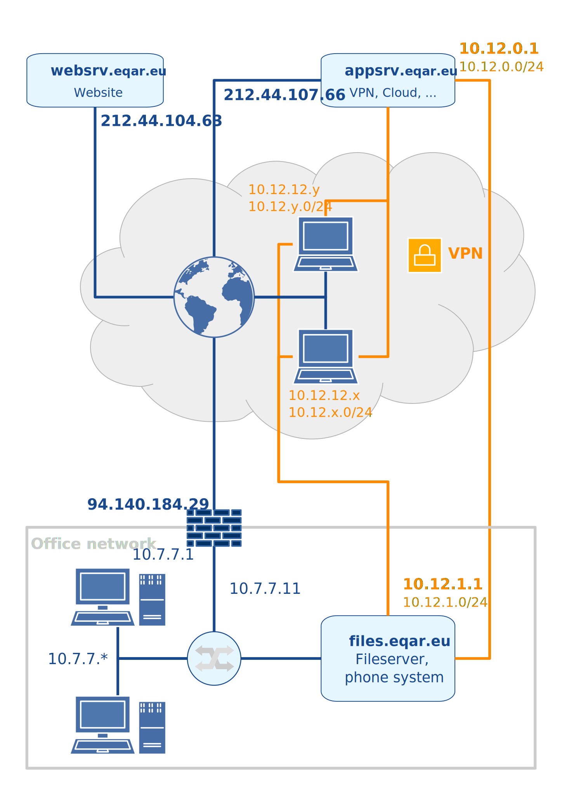

# ICT Infrastructure

EQAR's information and communications technology (ICT) infrastructure consists of a suite of services facilitating the organisation's work. These are provided by a physical server (located at the EQAR office), several virtual servers (VPS) and external service providers.

- Managed Software Center

EQAR staff can find an internal portal with links to all relevant sites and services at: <https://appsrv.eqar.eu/>

## EQAR User

> **Relevant for:** staff, committee members, externals (e.g. project partners)

One single login/account is used for office computers, most EQAR-hosted services (e.g. NextCloud) and some external services. Your username is the first letter of your first name, followed by your lastname, all in small letters and without diacritics. For example, `jdoe` for John Doe.

You can manage your account and change your password at <https://accounts.eqar.eu/>.

### Reset Password

In order to activate your login, you will have to use the password reset function:

 1. Go to <https://accounts.eqar.eu/reset-password/>.

 1. Enter your username or the email address to which your account is linked.

 1. A link to reset your password will be sent by email. Use the link to set a new personal password.

If you forgot your password, use the same password reset function.

### Services

The EQAR user login is used for the following services:

- NextCloud <https://cloud.eqar.eu/>
- Slack <https://eqarworkspace.slack.com/>
- Zoom <https://eqar-eu.zoom.us/signin>
- WordPress admin <https://www.eqar.eu/edit/>
- Website analytics <https://analytics.eqar.eu/>
- Contact database <https://db.int.eqar.eu/>
- Limesurvey <https://survey.eqar.eu/admin/>
- Trello <https://trello.com/login> (via Slack: click "Log in with SSO", then "Continue with Slack")
- Office desktop computer login
- File sharing access

The following acounts are _separate_, i.e. each have their own username/password:

- Email: your email account has a separate password, which can be changed through the [webmail interface](https://webmail.all-inkl.com/). The login name is your email address, `firstname.lastname@eqar.eu`
- DEQAR [backend](https://admin.deqar.eu/): your username for the DEQAR backend is separate.
- Laptop: since it is not always connected to the network, your login on the laptop is local and with a separate password. The username is your firstname, in small letters, e.g. `john` for John Doe.
- Personal accounts for [FCm Arrivon](https://www.arrivonbyfcm.be/prdtlc/home.do?country=BE&language=en&BV_UseBVCookie=no&company=eqarbe&siteKey=FCM%23BE) (travel booking).
- Shared accounts (one account used by all staff) are in use for [Formsite](https://fs1.formsite.com/form_app/FormSite?FormId=LoadLogin&Auto) and some other services.

## Video Conferences

> **Relevant for:** staff, committee members, externals (e.g. project partners)

EQAR uses [Zoom](https://eqar-eu.zoom.us/signin) for audio and video conferences.

As EQAR staff hosting a conference, you should log in with your EQAR user. Please share the meeting link and room ID with participants before the meeting.

As participant, you only need the link received from the EQAR staff member hosting the conference.

There are two ways to join a Zoom conference:

 1. **Using your computer audio and video** (recommended)

    This requires a stable internet connection, a functioning speaker/headphone and microphone.

    To join a Zoom conference, simply open the link that has been sent to you by the EQAR Secretariat.

    When using Zoom for the first time, you will have to download and install a small program, but this will not take long.

 2. **Dial in by phone**

    If you do not have a functioning speaker and microphone, or you cannot download any software to your computer, you can dial into the conference using a regular telephone. See the [list of dial-in number for various countries](https://zoom.us/zoomconference)

    In addition, you can join the conference using your web browser for viewing video or screen sharing. Use the link sent to you, cancel any download/installation  and click on the link "join from your browser".

## Cloud File Storage

> **Relevant for:** staff, committee members, externals (e.g. project partners)

All meeting documents etc. are posted on a cloud storage application, [NextCloud](https://www.nextcloud.com/), hosted on an EQAR server.

Login at: <https://cloud.eqar.eu/> (with your EQAR username/email and your EQAR password)

EQAR staff will see a group folder named `EQAR documents` in their home folder, which includes subfolders for different topics, projects and meeting documents.

EQAR committee members and externals will see the folder(s) of their committee/project in their home folder.

NextCloud includes two applications that allow collaborative text editing:

- The simple text editor (*New text document*) has only basic formatting, but is very performant. It is ideal for simple notes etc.

- The Collabora Online application (*New Document*, *New Spreadsheet*, *New Presentation*) is an on-line version of LibreOffice. It is not always most performant, but offers a more complete feature set.

## Internal Website

> **Relevant for:** staff, committee members

The restricted part of the EQAR website contains information for EQAR staff and committee members, including links to meeting documents.

Login at: <https://www.eqar.eu/login/> (with your EQAR username/email and your EQAR password)

## VPN

> **Relevant for:** staff

Some services are restricted and accessible only from EQAR's own network. Office computers are always connected to the EQAR network; the same applies to the `eqar_staff` WiFi available at the office.

To access those services while travelling or when at home, you need to be connected to the Virtual Private Network (VPN). The VPN establishes a secure, encrypted connection (called a tunnel) between your device and the EQAR network, so that all further connections to devices on the EQAR network are as secure as if you were connected physically to the office network.

The VPN solution used by EQAR is [WireGuard](https://www.wireguard.com/). The `EQAR-VPN` connection is pre-configured on your laptop. It includes a personal cryptographic key that gives access to the network. If your device was stolen or someone gained unauthorized access to it, the key will be removed from the list of authorised keys and you receive a new key.

The software should be started automatically when you log in and can be configured to connect automatically when an internet link is available. You should leave WireGuard connected at all times.

## Email

> **Relevant for:** staff

The standard email client on the office computers and laptops is Apple Mail. You can use [Mozilla Thunderbird](https://www.thunderbird.net/) alternatively.

You will have two mailboxes pre-configured on your office computer or laptop: a personal one and a shared mailbox. Your personal email address is `firstname.lastname@eqar.eu`; the email addresses `info@eqar.eu` and `application@eqar.eu` arrive into the shared mailbox.

To access your emails from outside the office, you have two possibilities:

 1. **Webmail (by our hosting provider)**

    URL: <https://webmail.all-inkl.com/index.php>

    Login: `firstname.lastname@eqar.eu`

    Here, you can also change your email password, install spam filter and other custom filters to sort incoming mail to different folders automatically, and setup auto-reply messages.

 1. **Configuring your own email client at home (via IMAP)**

    You can access your emails from all typical email clients (Thunderbird, Outlook, Apple Mail, …) via IMAP. You should use IMAP with TLS/STARTTLS, so that your password and emails are transmitted via an encrypted connection. Some programmes will correctly auto-configure once you enter the email address, but otherwise use the following settings:

    Incoming server: `w00940ec.kasserver.com` (IMAP, port 143 & TLS)

    Outgoing server: `w00940ec.kasserver.com` (SMTP, port 587 & TLS)

    Your username is your email address for both, and the password is the same as for the other options.

    You can customise your email signature from [your profile page](https://appsrv.eqar.eu/tools/profile/).

## Slack

> **Relevant for:** staff, external partners

Slack is an instant-messaging service used for our daily communication, especially between colleagues when working remotely. Our Slack workspace also includes the external DEQAR software development team and some external project partners.

You can use Slack from your web browser or as an installed application. On the desktop, both options work fine; on your phone, you need to install the Slack App.

The Slack workspace is accessible at <https://eqarworkspace.slack.com/> (log in with your EQAR username and password).

## Trello

> **Relevant for:** staff

Trello is a web application for managing project and team collaboration. It is based on organising lists of cards, usually each representing a task or issue. The cards come with various features, such as checklists or deadlines.

Staff need to create a separate free account at Trello and will be added to the [EQAR team To-Do board](https://trello.com/b/o8vTcuF9/eqar-team-to-do).

The EQAR team board includes a common *Inbox*, where new tasks can be added if they still need to be assigned to someone. Next to it, the board has one list per staff member.

You should keep your list up-to-date to reflect your current tasks and priorities. When tasks are completed, you should archive the card.

## Contact Database

> **Relevant for:** staff

The Contact Database (DB) is used both as a shared address book for all sorts of contacts, but also to keep information on EQAR's official relationships (members, registered agencies) and formal interactions with them (applications, change reports, annual updates).

You can access the Contact DB at <https://appsrv.eqar.eu/db/> (login with your EQAR username and password).

Data is stored in a number of **tables**, each row representing a record in a fixed format. The tables are linked with each other, i.e. a record in one table often refers to a corresponding record in a different table. You will find both one-to-one (e.g. an organisation may also be a registered agency or a member) or one-to-many (e.g. an organisation can have many contact persons, or a registered agency can have several substantive change reports).

When a record "belongs" to another record in another table, this link is usually shown as a drop-down box in the record data. When several records in another table (may) belong to a record, this you see buttons under *Related records* in the bottom of an edit window. In case of one-to-one relationships, corresponding records from different tables usually show together and can be edited together.

While you generally edit data in tables, **queries** represent different pre-defined views that show data from one or several tables. You cannot edit data in a query, but many queries show an edit button leading that opens the record in an underlying table (where one row in a query equates one record in a specific table).

The main functions for records or tables are:  
 **edit** record (in case of query, edits record in underlying table)  
 **view** record (in read-only table or query)  
 **delete** record (in case of query, deletes record in underlying table)  
 **create** new record  
 **download** current view as CSV file  
 **fill** template or existing document with record data (ODT files only)  

The **fill template** function is available both from the list and from an open record (small button next to unique ID of the record). You can upload a template document or an existing document to refresh data. The text of the document will not be changed, only field codes will be added/updated. This feature fills data from the current record and cascades two levels further to include "superior" records. The data is saved in document metadata and can be accessed as fields (menu: *Insert* &gt; *Field* &gt; *More fields...* or shortcut: &#8997;`F2`, tab *DocInformation*, entries under *Custom*).

With the **search box** on the main page, you can perform a quick search across most tables. This is the easiest way to check, for example, whether a person is already included in the contact DB.

The following overview of tables is organised to illustrate the main relations. Strictly speaking, there is no hierarchical order and there are several more relations between tables.

The column *Cardinality* describes how many of these records can exist, in relation to one record in the "parent" table:

* ** 0..1 ** none or one, e.g. an organisation may be an EQAR member, but does not have to be, and it can only once be a member
* ** 0..\* ** any number, e.g. there is not necessarily any Register Committee member with conflict of interest in a case, but there may be one or several
* ** 1..\* ** at least one, e.g. there is at least one application from an organisation that has applied for registration

| Table                                                                 | One record describes ...                                                                      | Cardinality   |
|-----------------------------------------------------------------------|-----------------------------------------------------------------------------------------------|:-------------:|
| **Organisations**                                                     | any kind of organisation that EQAR is in contact with                                         |               |
| &ndash;&nbsp;EQAR&nbsp;Members                                        | an organisation that is a member of EQAR                                                      | 0..1          |
| &ndash;&nbsp;Registered&nbsp;and&nbsp;applicant&nbsp;agencies         | an organisation that is a registered agency or that had applied for registration              | 0..1          |
| &ndash;&nbsp;&ndash;&nbsp;Applications                                | one application for registration or renewal of registration                                   | 1..\*         |
| &ndash;&nbsp;&ndash;&nbsp;&ndash;&nbsp;Panel&nbsp;members             | one external review panel member in that application                                          | 1..\*         |
| &ndash;&nbsp;&ndash;&nbsp;&ndash;&nbsp;Clarification&nbsp;requests    | one clarification request made in the context of an application                               | 0..\*         |
| &ndash;&nbsp;&ndash;&nbsp;&ndash;&nbsp;Conflicts&nbsp;of&nbsp;interest | one Register Committee member who declared conflict of interest for an application           | 0..\*        |
| &ndash;&nbsp;&ndash;&nbsp;Substantive&nbsp;Change&nbsp;Reports        | one Substantive Change Report by a registered agency                                          | 0..\*         |
| &ndash;&nbsp;&ndash;&nbsp;Annual&nbsp;updates                         | the number of EQA activities by one agency, of one type, in one country, in one year          | 0..\*         |
| &ndash;&nbsp;DEQAR&nbsp;CONNECT&nbsp;partners                         | an organisation that is a project partner in DEQAR CONNECT                                    | 0..1          |
| &ndash;&nbsp;DEQAR&nbsp;project&nbsp;partners                         | an organisation that was a partner in the 1st DEQAR project                                   | 0..1          |
| &ndash;&nbsp;Financial&nbsp;accounts&nbsp;(Octopus)                   | an organisation that has a supplier or client account in EQAR's accounting                    | 0..1          |
| **Persons**                                                           | any individual                                                                                |               |
| &ndash;&nbsp;Contact&nbsp;person                                      | a link of an individual to an organisation                                                    | 0..\*         |
| **Countries**                                                         | a country                                                                                     |               |
| **Organisation roles**                                                | a type of organisation                                                                        |               |

## Internal File Storage

> **Relevant for:** staff

The internal file server is for storing all files and documents worked on by EQAR staff. You can access it at the office and remotely (when connected to the VPN).

There are four important shares, available on your office desktop or on your laptop under `/c`:

| Name              | Content                                                                                                                                                       |
|-------------------|---------------------------------------------------------------------------------------------------------------------------------------------------------------|
| **eqar\_doc**     | All EQAR documents, except: temporary files, personal files and very large files (high-res pictures, videos, etc.)                                            |
| **eqar\_archive** | Old EQAR documents (files should be moved here when they are likely to create confusion in eqar\_doc; all files moved her automatically become read-only)     |
| **home**          | Share for your personal files, not accessible by other users                                                                                                  |
| **media**         | For large or not very important files                                                                                                                         |

### Synchronisation to Laptops

The `eqar_doc` share is the most used in your daily work. Since access from remote can be slow, all EQAR laptops are configured to keep a local copy of this share. It is synchronised with the file server using an application called [Syncthing](https://syncthing.net/), which runs in the background. (Syncthing only works within the EQAR network and thus only when you are connected to the VPN.)

All changes made on your laptop are propagated to the file server and all other laptops immediately when on-line, or the next time you are connected to the internet and the VPN. Therefore, please mind the following:

* Files deleted (even if only moved to trash on your own computer) are irrevocably deleted from the server and other computers.

* When you move files, they are actually deleted and newly copied. That is, when you move a whole folder structure, with many subfolder and files in it, this causes a lot of traffic and calls for trouble. Thus, make sure to think of folder structures carefully from the very beginning, so that no large number of files need to be moved later on.

* Avoid opening and editing files concurrently with other users. While Syncthing can detect two users changing having changed a file during an offline period (and then keeps both versions), this is not perfect and doesn't work if two people have the same file open while on-line; the latest to save will overwrite the other's changees. When working in LibreOffice, lock files are synchronised to prevent this; in other applications this is not the case. If several users need to work on one document simultaneously, use the plain text editor of NextCloud with preference.

* To avoid excessive traffic, do not place very large files in `eqar_doc`. Use either the `media` share (if files are for EQAR staff) or save the files on NextCloud if they are potentially shared with outsiders (e.g. webinar recordings).

### Snapshot Backups

All shares are backed up redundantly to a NAS device in the office (every two hours on weekdays) and to a cloud storage (daily). Both backup stores retain snapshots from the last hours and days, as well as over longer periods of time. That is, if accidentally deleted or overwritten, a file can usually be retrieved, incl. several previous versions if needed, while the work of the last two hours might be lost.

> **Please note**: only the file server is backed up. Files saved on your local computer or laptop only are not backed up.

### Organising Files

#### General

As several people use the file shares in their work, please follow these general principles:

* Make sure to name and structure folders and files clearly and logically, so that others can find documents intuitively.

* Create folders and subfolders to make sure that the number of files in one folder doesn't grow excessively.

* Try to think ahead when creating folder structures and naming files, i.e. ask yourself which other files might end up in the same folder later. (This will avoid excessive moving later on.)

* Third-party documents (e.g. from meetings attended, etc.) should be saved in `eqar_doc` only when EQAR staff has worked on them, or if they are really essential for EQAR (`eqar_doc` is not a library, but for documents worked on by EQAR staff).

#### Versions

In order to ensure consistency and clarity, every document should normally only exist once in an editable format (i.e. OpenDocument or Microsoft office format). This should be the latest version.

Older version should generally not be edited, and hence be kept in PDF format if they need to be retained (e.g. in case of official documents). In that case, versions should be numbered for clarity.

When it is not really necessary, there is no need to retain old versions explicitly, as they could be retrieved from the backup if really needed.

In other words: as a rule, there should be one editable document without a version number, and there can be several PDFs, each with a version number.

The following would be a typical number of files for a formal document:

* `RC26_03_1_NewSpecialPolicy.odt`: latest version, editable
* `RC26_03_1_NewSpecialPolicy_v0_1.pdf`: version 0.1 – e.g. first draft
* `RC26_03_1_NewSpecialPolicy_v0_2.pdf`: version 0.2 – e.g. revised draft
* `RC26_03_1_NewSpecialPolicy_v1_0.pdf`: version 1.0 – (first) final
* `RC26_03_1_NewSpecialPolicy_v1_1.pdf`: version 1.1 – draft revision
* `RC26_03_1_NewSpecialPolicy_v2_0.pdf`: version 2.0 – (revised) final

If there are good reasons, you can always choose a different structre.

#### Naming

Official meeting documents should be named after a common format:

`BBn_ii_x_tttt...`

|       | |
|-------|-------------------------------------------------------|
| BB    | Statutory body (EB, GA, RC, AC)                       |
| n     | Number of the meeting (see folder names)              |
| ii    | Number of the item on the agenda, or M for minutes    |
| x     | Document number under this item (starting with 1)     |
| tt... | Description of the document (text)                    |

#### Directory structure

The following is the main structure of the `eqar_doc` share; the `eqar_archive` share mirrors that structure.

- **Administration**: documents on various administrative issues/topics

    - **Corporate Design**: information about the EQAR corporate design
    - **Fonts**: EQAR standard fonts for use in publications
    - **Logos**: EQAR logo in different versions, resolutions and file types; partner logos (E4); Commission logo; Bologna logo
    - **Membership**: memberships of EQAR in other organisations
    - **Moniteur Belge**: publications in the Belgian official gazette
    - **Office**: office rent etc.
    - **Printing**: stationery, business cards, etc. ready for printing as PDF
    - **Templates**: various templates for letters, standard documents, official documents, internal notes and presentations
    - **Trademark**: documents related to the registration of EQAR as a trademark
    - **Travel**: relating to contracts with the travel agency, insurances, etc.

- **Agencies**: everything related to applications and registered quality assurance agencies

    - **00\_Open**: shortcuts to applications that are currently considered
    - **AGENGY-ACRONYM**: subfolder for each agency
        - **YYYY-MM_TYPE**: subfolders for applications, change reports, etc., with *YYYY-MM* being the submission date and *TYPE* being *Initial* application for inclusion, *Renewal* application, substantive *Change* report, third-party *Complaint* or *Extraordinary* review of registration

- **Correspondance**; general correspondence, unless it belongs somewhere else

    - **Annual Update**: annual surveys of registered agencies on their EQA activities
    - **EQAR Communication with NonMembers**: letters to non-member EHEA governments
    - **Incoming**: incoming letters, faxes, etc.
    - **Nominations**: invitations to nominate EB and RC members
    - **Signatures**: scanned signatures

- **Documents**: all sorts of documents that do not fit anywhere else, such as leaflets, papers, notes, etc.; larger publications (e.g. Annual Report, Guide for Applicants, Internal Handbook) have their own subfolder

    - **Articles**: articles written by EQAR staff for newsletters, publications, etc.
    - **BFUG Reports**: EQAR reports/updates prepared for the Bologna Follow-Up Group meetings
    - **CVs**: CVs of EQAR staff and committee members
    - **E4**: documents of E4 meetings
    - **EQAR Charts**: charts explaining EQAR, can be used for publications
    - **ESG Revision**: documents from the 2012-2015 ESG revision process
    - **External meetings**; key documents from external meetings/groups in which EQAR is represented
        - **GROUP/MEETING**: subfolders by different groups or meetings
            - **DATE AND PLACE**: subfolders by meetings of that group
    - **Internal**: internal notes or communicationsa
    - **Mailtool**: documents for serial emails
    - **Presentations**: presentations given by EQAR representatives externally
    - **Reports**: essential third-party reports that are of special interest for EQAR, e.g. ESG and Bologna communiqués
    - **Various**: anything that does not fit somewhere else &ndash; avoid.

- **External meetings**: link to this folder under *Documents*

- **Finances**: finance-related documents

    - **AirPlus**: related to AirPlus company and debit accounts, payment means for travel bookings
    - **AnnualAccounts**: final, audited versions of all annual accounts
    - **Envelopes**: payment envelopes
    - **Expenses**: incoming invoices, with subfolders per year, within each folder documents numbered by Octopus document number
    - **Invoices**: outgoing invoices, with subfolders per year, within each folder documents ordered by invoice number
    - **Membership fee scale**: supporting documents for calculation of membership fees (e.g. GDP data)
    - **Octopus backups**: backup files of the accounting software
    - **Reimbursement**: reimbursement forms (both internal and external)
    - **VAT**: documents related to VAT

- **Meetings**: files related to the organisation of EQAR meetings; content documents are stored under *Official documents* for EQAR statutory body meetings and here for other meetings (e.g. Members' Dialogue)

    - **MEETING_YYYY-MM-DD**: subfolders per meeting

- **Official documents**: all content documents of official statutory meetings/bodies
    - **Applications**: various internal and external templates (e.g. Internal Assessment Sheet, decisions, cover letters, ...)
    - **EBnn, GAnn, RCnn, ACnn**: subfolders for each particular meeting of the Executive Board, General Assembly, Register Committee, Appeals Committee
    - **EB, GA, RC, AC** (without number): documents and decisions made by email, and documents of a permanent nature (i.e. policies, Code of Conduct, or similar)
    - **Founding**: documents related to the official founding of EQAR
    - **Membership**: official documents related to membership in EQAR (governments, E4, ...)
    - **Statutes**: EQAR statutes, final version and earlier drafts (see archive)

- **Projects**: all documents related to specific projects (coordinated by EQAR or not)
    - **PROJECT\_ACRONYM**: subfolder for each project, with a subfolder structure within that is appropriate to the project

- **Staff**: everything related to Secretariat staff (mostly accessible to Director only)

- **Website**: documents related to the website www.eqar.eu
    - **Photos**: photos of all EQAR staff and committee members – only for small, edited pictures – use media share for big files!

## Shared Calendar

> **Relevant for:** staff, president

We are using a shared calendar via NextCloud. It can be accessed via the NextCloud web interface, Thunderbird, the Apple Calendar app or any program supporting CalDAV using the following URL:

<https://cloud.eqar.eu/>

Please prepend event titles with your initials (and those of other EQAR staff involved).

## Technical details

> This section documents the technical details and is **not** meant for regular users.

### Network

The office network is a Gigabit Ethernet network managed by a switch. Cabling and network rack belong to Neth-ER. There are two separate VLANs:

 1. The **EQAR internal LAN** (_VLAN 50, IPv4 subnet 10.7.7.0/24, WiFi eqar-staff_) has full access to all hosts and services. It is for staff and committee members.
 1. The **Guest network** (_VLAN 51, IPv4 subnet 10.10.10.0/24, WiFi eqar-guest_) has internet access, but no privileged access to hosts and services. It is for guest use.

The **EQAR VPN** (_IPv4 subnet: 10.12.0.0/16_) includes the cloud infrastructure and VPN clients. It is subdivided in a number of /24 subnets, as detailed in the table below.



Traffic is fully routed between the EQAR internal LAN and VPN. Mobile clients have two WireGuard endpoints (office sever and VPS) configured, creating some degree of redundancy.

Internal DNS servers run on the office file server and the application server VPS. Office clients use the former as primary and the latter as secondary DNS resolver, VPN clients vice-versa. The VPS hosts the master copy of internal zones, the office server functions as slave.

The internal DNS servers resolve `appsrv.eqar.eu`, `backend.deqar.eu`, `testing.eqar.eu` and `webapps.eqar.eu` to their internal IP addresses, so that all services are accessed through the EQAR network/VPN, when connected to it. This extends to all additional DNS names of these VPS, except `vpn.eqar.eu` (as the VPN connection itself can't be routed through the VPN for obvious reasons).

The canonical way to test the connection to the EQAR network is to open <https://appsrv.eqar.eu/>: it leads to the internal portal from the VPN or LAN, and to an access-denied page from external IPs.

The following tables summarise the statically and dynamically assigned IP addresses in the networks:

| Public IP     | Host                                      | DNS name(s)                                                                           | Services (available publicly)                                                                                                 | 
| ------------- | ----------------------------------------- | ------------------------------------------------------------------------------------- | ------------------------------------------------------------------------------------------------- |
| 94.140.184.29 | EQAR file server (public IP via Neth-ER)  | office.eqar.eu                                                                        | SSH (222 → 10.7.7.10),<br />WireGuard (10100),<br />SIP (5060/1),<br />RTP (10000/50 → 10.7.7.11) |
| 212.44.107.66 | EQAR application server (KVM VPS)         | appsrv.eqar.eu,<br />various CNAMEs,<br />vpn.eqar.eu                                 | HTTP & HTTPS<br />WireGuard (51820)<br />LDAP (from websrv)<br />SSH (from known IPs)             |
| 212.44.104.63 | EQAR webserver (LXC VPS)                  | www.eqar.eu<br />\*.eqar.eu                                                           | HTTP & HTTPS                                                                                      |

| LAN IP                        | Host                                  | Services (interal)                                                                                            | Host config   |
| ----------------------------- | ------------------------------------- | ------------------------------------------------------------------------------------------------------------- | ------------- |
| 10.7.7.1                      | Router (managed by Neth-ER)           | DHCP<br />DNS<br />default gateway                                                                            | static        |
| 10.7.7.10<br />nas.eqar.eu    | EQAR NAS (Netgear ReadyNAS Duo)       | SSH(222)<br />rsync                                                                                           | static        |
| 10.7.7.11<br />files.eqar.eu  | EQAR file server (Rack-mount server)  | SSH<br />DNS<br />HTTP & HTTPS<br />LDAP (replica)<br />Kerberos KDC (replica)<br />CIFS/SMB<br />Syncthing   | static        |
| _10.7.7.12-19_                | _reserved (future servers)_           |                                                                                                               |               |
| 10.7.7.20                     | Printer LaserJet                      | IPP, LPD, 9100                                                                                                | static        |
| 10.7.7.21                     | Printer Ineo+ 224e                    | IPP, LPD, 9100                                                                                                | static        |
| _10.7.7.22-29_                | _reserved (future printers)_          |                                                                                                               |               |
| 10.7.7.30                     | unused (was: EQAR-desktop-4 Colin)    |                                                                                                               |               |
| 10.7.7.31                     | EQAR-vm-1 (VirtualBox, Win7 guest)    |                                                                                                               | static        |
| 10.7.7.32                     | EQAR-vm-2 (LXC, Debian GNU/Linux)     |                                                                                                               | static        |
| _10.7.7.33-39_                | _reserved (future use)_               |                                                                                                               |               |
| 10.7.7.41                     | IP phone Colin – ext. 3911            |                                                                                                               | static        |
| 10.7.7.42                     | IP phone Annelies – ext. 3912         |                                                                                                               | static        |
| 10.7.7.43                     | IP phone Sandra – ext. 3913           |                                                                                                               | static        |
| 10.7.7.44                     | IP phone NN – ext. 3914               |                                                                                                               | static        |
| 10.7.7.45                     | IP phone Melinda – ext. 3915          |                                                                                                               | static        |
| 10.7.7.49                     | IP phone Polycom – ext. 3918          |                                                                                                               | static        |
| _10.7.7.46-59_                | _reserved (future IP phones)_         |                                                                                                               |               |
| 10.7.7.60                     | WLAN access point Cisco               | SSID: eqar-staff & eqar-guest                                                                                 | static        |
| 10.7.7.61                     | AR300M WLAN bridge                    | 22(SSH)                                                                                                       | static        |
| _10.7.7.62-99_                | _reserved (future use)_               |                                                                                                               |               |
| 10.7.7.100-199                | DHCP pool for office clients          |                                                                                                               | dynamic DHCP  |
| _10.7.7.200-253_              | _reserved (future use)_               |                                                                                                               |               |
| 10.7.7.254                    | Managed switch (Cisco SG200-26P)      |                                                                                                               | static        |
             
| VPN IP            | Host                          | Services (in addition to public)                                                          | Host config       |
| ----------------- | ----------------------------- | ----------------------------------------------------------------------------------------- | ----------------- |
| 10.12.0.1         | EQAR application server (VPS) | SSH<br />DNS<br />LDAP<br />MariaDB<br />Kerberos KDC & kadmin see above (appsrv.eqar.eu) | static            |
| _10.12.0/24_      | _reserved (future use)_       | _routed to application server_                                                            |                   |
| 10.12.1.1         | EQAR file server (office)     | see above                                                                                  | static           |
| _10.12.1/24_      | _reserved (future use)_       | _routed to file server_                                                                   |                   |
| 10.12.10/24       | Containers (systemd-nspawn)   | running on application server                                                             |                   |
| 10.12.11/24       | Containers (Docker)           | running on application server                                                             |                   |
| 10.12.12/24       | VPN clients                   | only IPs 100-250 used                                                                     |                   |
| 10.12.100-250/24  | VPN clients (local subnets)   | one /24 subnet is reserved for and routed to each client                                  |                   |

| Guest IP          | Host                          | Services                              | Host config   |
| ----------------- | ----------------------------- | ------------------------------------- | ------------- |
| 10.10.10.1        | Router (managed by Neth-ER)   | DHCP<br />DNS<br />default gateway    | static        |
| 10.10.10.100-250  | DHCP pool for guest clients   |                                       | dynamic DHCP  |

### Client Configuration

Office computers and laptops are configured and managed through:

- [Munki](https://www.munki.org/munki/) Managed Software Center, used to install:
    - System configuration profile
    - Kerberos configuration
    - All common software packages
- LDAP (user database and automount)
- User-level configuration profile (install from <https://appsrv.eqar.eu/tools/profile/>)

### LDAP

LDAP service is provided by [OpenLDAP](https://www.openldap.org/)'s slapd.

EQAR users, groups and network configuration (e.g. automounts) are stored under `ou=users,dc=eqar,dc=eu`. This tree is served by `ldap.int.eqar.eu` (alias for `auth-prod` container) as master and by `ldap-1.int.eqar.eu` (alias for `files` server) as a replication for redundancy; machines dependant on the common user database have both servers configured.

In addition, `ldap-contacts.int.eqar.eu` (alias for `php-prod` container) provides read-only access to the EQAR contact DB via LDAP under `dc=Contacts,dc=eqar,dc=eu`.

#### Staff user template

```ldif
uid: ltest
sn: Doe
givenName: John
loginShell: /bin/bash
uidNumber: 1099
gidNumber: 1999
mail: test123@eqar.eu
cn: John Doe
gecos: John Doe
homeDirectory: /c/home/ltest
userPassword: {SASL}ltest@EQAR.EU
objectClass: apple-user
objectClass: inetOrgPerson
objectClass: organizationalPerson
objectClass: person
objectClass: posixAccount
apple-generateduid: 9cbd4680-ad17-1038-9178-e9c56baf7c31
```

#### Committee or external user template

```ldif
uid: mnovak
userPassword: {SASL}mnovak@EQAR.EU
sn: Novak
givenName: Mojca
cn: Mojca Novak
mail: mojca@novak.si
objectClass: inetOrgPerson
objectClass: organizationalPerson
objectClass: person
```

(in addition, add `memberUid:` to group)

#### Posix group template

```ldif
cn: externals
gidNumber: 1999
description: External accounts
objectClass: posixGroup
```

### Kerberos

Kerberos 5 is used for central password database and single sign-on in EQAR. The realm used is `EQAR.EU`.

The primary Kerberos database is hosted on `auth-prod` (alias: `kerberos.int.eqar.eu`); this machine provides both Key Distribution Center (KDC) and administration server (e.g. for password change) service.

A backup KDC is run on `files` (alias: `kerberos-1.int.eqar.eu`), serving a replica of the Kerberos database. The database is propagated every 15 minutes, triggered by a systemd timer on `auth-prod`, contacting kpropd(8) on `files`.

### Single Sign-On

Depending on the service, sign on works in either of three ways:

- Natively through Kerberos or GSSAPI
- LDAP bind, forwarded to Kerberos by SASL library
- SAML service provided by SimpleSAMLphp, using LDAP as a backend

The following tables shows which service/application used which approach:

| Service       | Authentication | Groups       | EQAR staff | Committees | Externals |
| ------------- | -------------- | ------------ |:----------:|:----------:|:---------:|
| NextCloud     | LDAP           | LDAP         | X          | X          | X         |
| Slack         | SAML           | n/a          | X          |            | X         |
| Trello        | SAML via Slack | n/a          | X          |            |           |
| Zoom          | SAML           | n/a          | X          | limited    | limited   |
| Wordpress     | LDAP           | local        | X          | X          |           |
| Matomo        | LDAP           | n/a          | X          |            |           |
| Contact DB    | PAM            | n/a          | X          |            |           |
| Profile       | Kerberos       | n/a          | X          |            |           |
| Limesurvey    | LDAP           | n/a          | X          |            | X         |
| SMB/CIFS      | Kerberos       | LDAP         | X          |            |           |
| mac OS login  | Kerberos/LDAP  | LDAP         | X          |            |           |
| Linux login   | PAM            | LDAP         | X          |            |           |
				
Login to these services is currently **not** integrated in the single sign-on solution:

| Service       | Protocol(s)   | Login type |
| ------------- | ------------- | ---------- |
| DEQAR         | web, REST API | individual |
| Email         | IMAP          | individual |
| FCm           | web           | individual |
| Formsite      | web           | shared     |

### File server

CIFS/SMB file services are provided by a Samba server. The server is configured to allow Kerberos authentication only.

The shares are located on a separate volume mounted at `/c`.

### Snapshot Backups

Snapshot backups are run using a set of [custom scripts](https://github.com/EQAR/backup-scripts), triggered by systemd timers.

Snapshots of the `/c` volume on `files` are saved to `eqar-nas` at two-hour intervals during weekday daytime, and daily to the cloud storage (at All-Inkl.com). The root volumes of `files`, `appsrv`, `backend.deqar.eu`, `webapps` and `testing` are backed up nightly to the cloud storage.

Database snapshots are taken from `appsrv` and `testing` nightly, and from `backend.deqar.eu` twice daily.

