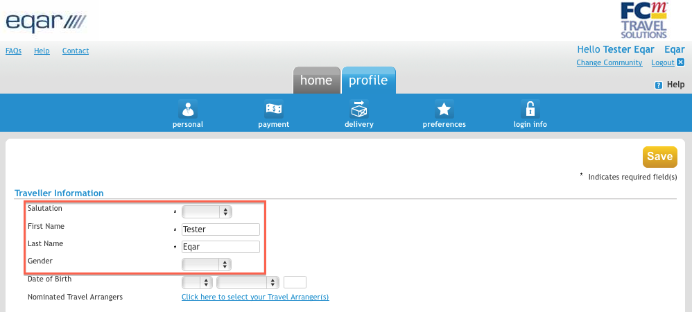
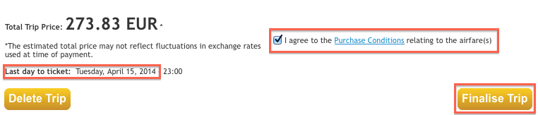

## Internal Website and Cloud

All meeting documents are posted on a cloud storage application (NextCloud) hosted by EQAR itself. Share links to documents are circulated before meetings and are also accessible from a secured section of the EQAR website:

 <https://www.eqar.eu/login/>

You need to log in with your personal username or email address and your password. The user name is the initial(s) of your first name(s) followed by your last name.

### Activating your login and setting your password

In order to activate your login, you will have to use the password reset function once:

 1. Click on &quot;Lost your password?&quot; below the login box, or [use this link](https://www.eqar.eu/wp-login.php?itsec-hb-token=edit&action=lostpassword)

 1. You will have to enter your username or registered email address, and a link to reset your password will be sent by email.

 1. You can now create a personal password using the link received by email.

### Forgotten password

If you forget your password you can always use the password reset function (described above) again.

## Teleconferencing

EQAR uses an application called Zoom for audio and video conferences.

There are two ways to join a Zoom conference:

 1. **Using your computer audio and video** (recommended)

    This requires a stable internet connection, a functioning speaker/headphone and microphone.

    To join a Zoom conference, simply open the link that has been sent to you by the EQAR Secretariat.

    When using Zoom for the first time, you will have to download and install a small program, but this will not take long.

 2. **Dial in by phone**

    If you do not have a functioning speaker and microphone, or you cannot download any software to your computer, you can dial into the conference using a regular telephone. See the [list of dial-in number for various countries](https://zoom.us/zoomconference)

    In addition, you can join the conference using your web browser for viewing video or screen sharing. Use the link sent to you, cancel any download/installation  and click on the link "join from your browser".

## Travel

### Reimbursement rules
*(adopted by the Executive Board on 15 September 2010)*

#### Principles
Travel and subsistence costs are reimbursed for all meetings of EQAR’s statutory bodies. Observers on the Register Committee are expected to cover their own travel costs. For General Assembly meetings, members are expected to make arrangements for and cover their own travel and accommodation costs.

Reimbursement is for all costs for all means of travel from the point of origin to the point of destination, and vice versa. This may include visa fees, travel insurance and cancellation costs, where justified.

Reimbursement of travel costs is based on actual costs as, independent of the means of travel (rail, bus, taxi, plane and car). You are kindly requested to use the most economical means of travel.

You are kindly asked to organise your journey so that overnight stays are minimised. If the travel costs are substantially lower when staying one or more extra nights (i.e. outweigh the costs of the extra stay), it is at your discretion which itinerary to choose.

Please hold on to all original receipts (including boarding passes) and hand them in to the Secretariat together with your reimbursement form.

You will always be reimbursed in Euro. In case you use a different currency, the official conversion rate by the European Central Bank (ECB) on the payment date will be applied.

#### Air travel
Flights are reimbursed in economy class.

Exceptionally, for long-haul travel involving any continuous flight of more than five hours, business class can be reimbursed. In this case please consult with the Secretariat before booking.

#### Rail travel
You are requested to travel in second/economy class, unless tickets in another class are cheaper at the time of booking.

#### Car travel
Expenses for private car travel (personal or company cars), where substantiated, will be reimbursed according to European Commission rate, currently EUR 0,22 per km.

#### Taxis
Taxi costs will be reimbursed if they are comparable to other means of travel or justified for late arrival, early departure, excessive luggage or similar reasons.

If several people travel together in one taxi, the person being reimbursed should specify who was travelling with him/her.

#### Car rental
Please ask authorisation beforehand for car rental.

#### Accommodation
The Secretariat normally takes care of all hotel bookings.

If you want to stay in a different hotel than the one designated by EQAR please inform the Secretariat beforehand. You will have to take care of the booking yourself and will be reimbursed afterwards (using the reimbursement form). However, the hotel has to be in the same price range and the reimbursement is limited to the costs of a single room. Any supplement for reserving a double room has to be covered by you.

#### Meals
EQAR normally organises lunches and dinners on the day(s) of the meeting and sometimes also the day before or after the meeting.

Breakfast is normally included in the organised accommodation. If this is not the case, it will be reimbursed afterwards.

Meals during travel and other refreshments will be reimbursed, where substantiated and not excessive.

For any questions in relation to reimbursements and applying these rules please contact the Secretariat. Any reimbursements beyond these rules need to be agreed with the Secretariat, whenever possible in advance.

 [Download: reimbursement form](files/EQAR Reimbursement form_version2017.xls)

### Online Travel Booking
For booking your flights to EQAR meetings or any external meetings where EQAR covers your costs, please use our on-line travel booking tool (Amadeus e-Travel Management) hosted by our travel agency, FCm Travel.

When booking through FCm/AeTM there is no need for prepayment of flights, as EQAR will be invoiced directly. Also, in case of unforeseen travel problems you will be able to access a 24H helpline (see below).

The website should be user-friendly and self-explanatory. However, for further reference, feel free to consult the different steps described below.

#### Access
To access the website please visit:

<https://e-travelmanagement2.amadeus.com/login/eqar>

Your login name is your email address.

If you login for the first time or you have lost your password, click on “Retrieve password”. It will be sent to you by email and you will have to change the password when logging in again.

#### Personal Profile

After your first login, you are invited to complete your personal profile. You can always return to your profile via the corresponding tab.

**Important:** You have to select a salutation and your gender at least. Otherwise, you will not be able to book any flights.

Under “Contact”, you may add your mobile phone number. This will then be automatically included in bookings.

Under “Passports” you can store passport number, expiry date, nationality etc. Passport information is only necessary when travelling to/from certain countries, and you will also be prompted at the time of booking.

Under “Air Travel Preferences” you can insert any frequent traveller cards you have, so that they will automatically be included in your bookings. You can also select seat preferences.

#### Booking
Once your profile is completed, you can select the tab “book” to reserve a flight. The booking engine is similar to many public booking sites, but offers some additional features.

Usually, looking for a round-trip ticket will provide the best offer. However, in some cases it might be worth comparing against two one-way bookings (to/from the meetings), as some flights that might be booked separately one-way cannot be combined in one ticket/round-trip booking. For special cases you may use a multi-destination booking.

After inserting your origin, destination and dates, you will see a list of possible flights/combinations that match your search. You can use the “Modify search” box (left-hand side) to fine tune your dates, for instance.

After selecting one itinerary, you will see a “Trip summary (unconfirmed)”. Here you can review the flights once again, select seats or make changes.

Here, you should accept the Purchase Conditions and click “Finalise”. Afterwards, you will need to insert the meeting name as “Trip name”, and you are able to review your seat preferences and frequent traveller cards.

#### Ticket Issue
**Important note:** FCm issues all tickets “off-line” (i.e. by an agent, not automatically) and normally does so only during regular office hours (Mon-Fri 8:30 – 18:00). You should always check the “last day to ticket” (see above). While this will often be the next day, but it may be earlier (i.e. same day) or later. If FCm is not open before the ticketing deadline (for instance, if you book on Friday late afternoon or during the weekend), the ticket cannot be issued. (Please only use the 24H helpline for normal ticket issue in urgent cases, since it will incur additional charges.)

You now have to click on “Confirm trip”/”Send for approval” or on “Hold trip”:

**A) Confirm trip/Send for approval**

This should be the usual choice. If your booking requires approval, a Secretariat staff will review and approve it shortly.

Afterwards, the e-ticket for your flight is issued and sent to you.

**B) Hold trip**

You can make a booking “on hold” until the last day to ticket indicated in the trip summary. This means the flights will be reserved with the airline, but can still be changed/cancelled free of charge as long as no ticket is issued. However, this also means the price is not fully guaranteed.

If you make a booking “on hold” you need to come back (via the tab “review”) and either cancel or confirm/submit it before the ticketing date.

There are **no reminders sent by FCm Travel and the ticketing date might change without notice**. Therefore, please only use this option if you are aware of the risks and try to confirm bookings the next working day if possible.

#### Customer Service
In case of questions or problems related to bookings you can reach the FCm Travel customer service by phone at:

**+ 32 2 719 48 93**

The regular customer service is available Monday to Friday, 8:30 - 18:00. Outside the regular hours please use the 24h helpline (+49 30 479076484) only in urgent cases since there is a 30€ per call charge to EQAR.

## Compensation for Register Committee members
All Register Committee members receive a compensation for their “volunteer contribution” amounting to 1000 EUR per annum. This compensation is intended to compensate for time dedicated to EQAR and fringe expenses (phone, copies, small refreshments etc.) not reimbursed by EQAR.

This amount will be transferred to your account towards the end of the calendar year. For incoming or outgoing RC members who have contributed to only one Register Committee meeting during that particular year (assuming a total of 2 RC meetings per year), an amount of 500 EUR will be paid.

