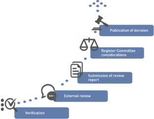
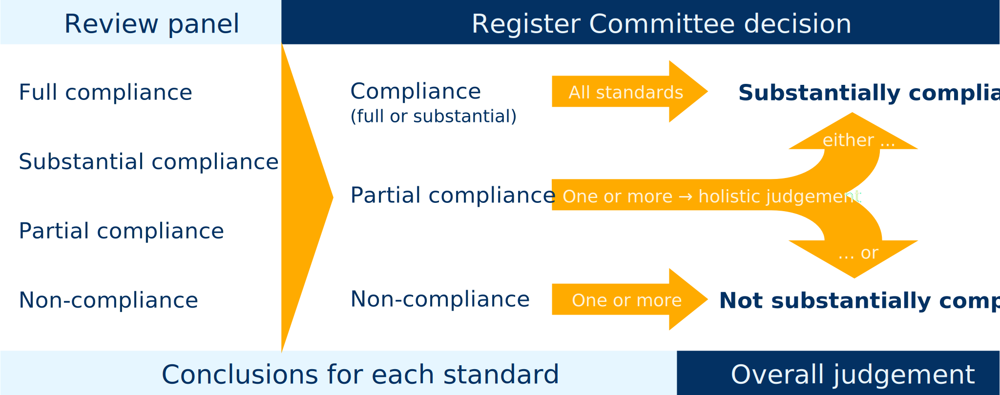

# Applications for Registration or Renewal

## Overview

An application for inclusion on the Register or renewal of registration involves three main steps:

 1. [**Verification of eligibility**](#eligibility-for-registration)

    Upon receipt of an application the Secretariat checks its completeness and compliance with the eligibility requirements specified in the Procedures for Applications. This concerns the applicant's activities as well as the (planned) external review process.

    The step results in tripartite terms of reference for the external review, or in an eligibility confirmation by EQAR.

 2. [**External review**](#external-review)

    Next, the agency is externally reviewed against the ESG. The review is coordinated by an independent third party, e.g. ENQA. EQAR is not directly involved in this step.

 3. [**Analysis and decision-making**](#analysis-by-rapporteurs)

    The external review panel's review report is the basis for the Register Committee's decision on the application. The review report is analysed by rapporteurs and the Register Committee makes a decision.

All decisions by the Register Committee on eligible applications (approval and rejection decisions) are published together with the full documentation of the application.

## Eligibility for Registration

### Activities

> 1.3 Registration pertains to all external quality assurance activities within the scope of the ESG, i.e. reviews, audits, evaluations or accreditations of higher education institutions or programmes that relate to learning and teaching in higher education, including the learning environment and relevant links to research and innovation. This is regardless of whether these activities are carried out within or outside the EHEA, and whether they are obligatory or voluntary.
> 
> 1.4 Organisations (or a clearly identified sub-unit thereof) that directly conduct external quality assurance according to §1.3 are eligible for registration.
> 
> 1.5 Registration is open to organisations regardless of whether they are based in Europe or outside, and regardless whether they are national or international in nature.

Only external quality assurance activities (i.e. review, audit, evaluation, accreditation etc. of higher education institutions or programmes) are considered in the remit of the ESG and, thus, only organisations that conduct such activities are eligible for inclusion on the Register.

Organisations which carry out only meta-level activities, such as standard setting or exercising oversight of quality assurance agencies, are not eligible for inclusion on the Register.

If an organisation conducts both external quality assurance activities in higher education as well as other activities, its inclusion on the Register only pertains to those sub-units/activities that are in the remit of the ESG. Nevertheless, all “ESG-type” activities have to be in substantial compliance with the ESG.

If there is a risk of confusion, the Register entry includes a specification to which sub-units or activities registration pertains.

### Requirements for External Reviews

The requirements for external reviews are set out in the Procedures for Applications. They are obligatory and a precondition for proceeding to consider the applicant’s substantial compliance with the ESG.

The Procedures specify the following requirements:

 -   The review must be coordinated by an organisation that is independent of the applicant and has the necessary professional capacity (§§1.6 – 1.8).

 -   The review panel has to comprise of at least four persons who have sufficient knowledge, experience and expertise for that task. It has to include at least one international expert, one academic staff member and one student (§§1.9 – 1.12).

 -   The self-evaluation report has to reflect on the applicant’s compliance with the ESG (§§1.13 – 1.14).

 -   The external review report has to provide sufficient evidence of the applicant’s substantial compliance with the ESG (§§1.15 – 1.18).

### Process

> EQAR staff: on [Trello board](https://trello.com/b/o8vTcuF9/eqar-team-to-do), use template checklist **Eligibility application**

Decisions on eligibility are prepared by the Secretariat and usually agreed by email, using the following process:

 1. Formal check of the application by the Secretariat

 1. If clarification on the activities is needed:
	1. The official representative of the applicant agency will be invited to have a telephone conversation with the Secretariat to clarify the issue(s) that arose.
	1. The phone conversation will be followed immediately by an e-mail enclosing the official minute – with the factual summary of the discussion – that the official representative will be asked to agree on.
	1. The official minute of the telephone conversation will be considered and annexed to the draft decision that will be circulated the Register Committee.
	1. If the applicant agency prefers not to have a telephone conversation, a written clarification request will be addressed to the agency.

 1.  Preparation of decision on eligibility:
	1. If there are contentious issues or new principle questions, the Secretariat appoint three rapporteurs for the case
	1. Otherwise, the Secretariat prepares the draft decision

 1.  Draft decision is circulated to the entire RC by email, with a comment deadline of 5 working days

 1.  Secretariat communicates the decision on eligibility to the agency

> **Note**: Thus far, the decision used to be communicated in form of a letter. Based on an agreement with ENQA, this is currently being replaced by Tripartite Terms of Reference: in that case, the decision will be communicated in form of amendments to the proposed Terms of Reference.

> Templates for EQAR staff (all filled from *Applications* table):
>
>  * `EQAR_DOC/Official documents/Applications/Templates internal/TEMP_IntAssSheet.odt`
>  * `EQAR_DOC/Official documents/Applications/Templates external/TEMP_Agency_EligibilityClarification_Minute.odt`
>  * `EQAR_DOC/Official documents/Applications/Templates external/TEMP_EligibilityConfirmation.odt` (phasing out)

## External Review

The applicant itself has to identify a suitable review coordinator that has the necessary professional capacity and is independent from the applicant. These requirements are checked at the eligibility stage. The most frequent coordinators of external reviews are ENQA (ca. 75% of cases) and the German Accreditation Council (GAC, ca. 20% of cases).

The coordinator of the external review has to declare in writing that it is independent of the applicant and that it has ensured that the review panel is fully independent of the applicant.

An assessment of the level of compliance with the ESG should be clearly defined as one purpose of the external review and the fact that the review report will be used for an application for (renewal of) inclusion on EQAR.

The review panel must consist of at least four persons that include at least one student and one academic staff member involved in education and research. The review panel should be fully independent from the applicant and should possess the knowledge, expertise and experience required to review the applicant’s compliance with the ESG. 

The self-evaluation and review reports should clearly address each relevant ESG (standards 2.1 to 2.7 and 3.1 to 3.7) and reflect on the agency’s compliance with it. In reviews that will be used for renewal of an agency's registration, it is expected that the review report explicitly addresses the issues that were flagged when the agency was admitted to the Register.

During the site visit, the external review panel is expected to interview all relevant stakeholders of the applicant agency, including students and staff, as well as external stakeholders, such as employers and external partners of an institution.

## Documents and Factual Basis

Following the external review, applicants submit the following documents to EQAR:

 1.  Declaration of Honour by the review coordinator, including CV's of all panel members
 1.  Self-evaluation report provided for the external review
 1.  External review report
 1.  Optional documents, e.g. a statement on the external review report or further supporting documentation

The main basis of the Register Committee's decision-making is the external review report. This principle should be respected even where other documents are considered.

Decisions made by the Register Committee should normally be based on the factors prevailing when the external review was undertaken. However, as far as is reasonable to do so in light of the considerations above (i.e. additional information should not be excessive; needs to be borne in mind that it was not reviewed) changes and developments since the external review should be taken into account when making a judgement.

Applicants are required to submit all documentation in English. Even if Register Committee members or Secretariat staff might understand other languages, documents in other languages should not form the basis of decisions taken by the Register Committee.

Applicants are guaranteed confidentiality of all documents while their application is being considered, but the Register Committee's final decision and all application documents are published if the application was eligible and complete (i.e. the external review report was submitted); see [section on publication](#publication-of-decisions) for details.

## Analysis by Rapporteurs

> EQAR staff: on [Trello board](https://trello.com/b/o8vTcuF9/eqar-team-to-do), use template checklist **Application - main stage**

Each application is assigned two rapporteurs who have the responsibility to analyse the documentation and make a recommendation for the Register Committee's decision.

The Secretariat assigns rapporteurs to the applications according to a fixed protocol in order of receipt of applications. For renewal applications, one rapporteur will be a Committee member who already acted as rapporteur in the initial application (if still on the Committee).

The Secretariat asks members to declare possible conflicts of interest relating to an application before appointing them as rapporteurs. Furthermore, it is ensured that the rapporteurs for one application are members nominated to the Register Committee by different organisations.

The rapporteurs’ work includes the following steps:

 1.  Each rapporteur reviews the application documents, records his/her comments on the Internal Assessment Sheet and sends it to the Secretariat staff member in charge.

 1.  The Secretariat circulates the two rapporteurs’ Internal Assessment Sheets to each other.

 1.  Rapporteurs discuss their findings in a teleconference facilitated by the Director and the Secretariat staff member in charge.

 1.  If necessary, clarification is requested from the applicants.

 1.  Rapporteurs set out their agreed findings on the Internal Assessment Sheet, with support from the Secretariat.

 1.  The Internal Assessment Sheet is submitted to the third rapporteur for review and comment.

The Secretariat assists the rapporteurs in their work and provides iterations of the final Internal Assessment Sheet. Once finalised, the Internal Assessment Sheets are circulated to the entire Register Committee in preparation for the meeting.

### Third Rapporteur

The third rapporteur comments independently of the main rapporteurs’ assessment. This mechanism helps to improve consistency and to base the preparatory analysis for the RC’s decision-making on a broader perspective.

The third rapporteur’s analysis normally takes place without further clarification requests to the applicant.

The views of the main rapporteurs and the third rapporteur are not discussed or mediated before the meeting. Possible different perspectives on an application are brought before the entire Register Committee.

### Clarification Requests

The principal basis of the Register Committee’s work is the external review report. Additional clarification might be necessary if the report does not cover all issues that are expected to be addressed. 

Additional information and clarification (whether in response to requests or submitted with the application) should only supplement and clarify the external review report, and should not be excessive. This is to ensure that externally reviewed evidence remains the main basis of EQAR’s decisions. For the same reason, clarification should with preference be sought from the external review panel; clarification requests to applicants themselves should only be made in exceptional cases, e.g. when strictly factual information is required.

The following flowchart illustrates when and from whom clarification should be sought:

Where the issue can reasonably clarified within about two weeks, a request is addressed to the panel/coordinator/applicant after consideration by rapporteurs and before first consideration by the entire Register Committee (see above, step 4). These requests are drafted by the Secretariat in consultation with rapporteurs and signed by the Director.

Where major questions remain after the Register Committee has first considered an application, it might defer the application to the next meeting, pending further clarification. This is, however, rare and delays the application by at least 4 months. The requests for clarification in such cases are signed by the Chair of the Register Committee.

> Templates for EQAR staff (all filled from *Clarification request* table):
>
>  * `EQAR_DOC/Official documents/Applications/Templates external/TEMP_Application_RapporteurRequest.odt`

## Register Committee Decision

The rapporteurs agree on a draft Register Committee decision, which is then considered by the Committee in plenary at its next meeting.

### Conclusions per Standard

The Register Committee is supposed to be seen in conjunction with the external review report. Thus, the decision does not address those standards where the Register Committee concurs with the review panel's analysis and conclusion, unless:

 - the agency was considered to be only in partial compliance with the standard before,
 - the standard was flagged for attention in a decision since the admission/last renewal (e.g. Substantive Change Report or Complaint),
 - the conclusion is partial compliance or non-compliance.

The following flowchart illustrates when the decision should include text regarding a specific standard, and its level of detail:

### Holistic Judgement

The Register Committee makes a holistic judgement on the agency's compliance with the ESG as a whole,  after considering how an applicant complies with each of the standards. The Register Committee has decided against applying any numerical formula in determining what constitutes **substantial compliance** with the ESG. There are several reasons why, in its view, this would be against the spirit of the ESG:

 -   The ESG were not designed as a checklist, and some standards are broader than others.
 -   Some standards may refer to more essential features of credible external quality assurance than others.
 -   External review panels interpret the ESG differently and use different scales of compliance.
 -   While there might be extenuating circumstances due to different legislative, political and socio-economic factors, the agency has to demonstrate how it meets the requirements of the ESG in its context.

Parts 2 and 3 of the ESG are those with direct relevance to quality assurance agencies and thus serve as criteria for inclusion on the Register. In reviewing the application, the Register Committee analyses each standard and reaches a conclusion of:

 -   compliance (which may be full or substantial),
 -   partial compliance or
 -   non-compliance

There is no distinction between substantial compliance and full compliance, since for inclusion on the Register it is sufficient to substantially comply with the ESG. 

If the agency is in compliance with all standards it is in substantial compliance with the ESG as a whole.

If there are one or several standards with which the agency complies only partially this is considered in the holistic judgement, which might be positive or negative depending on the number and significance of the areas where only partial compliance has been achieved. However, there are no numerical rules for arriving at a judgement.

As a rule, a conclusion of no compliance for any one standard prevents an overall judgement of substantial compliance.

The Register Committee's final judgement on the agency's compliance with the ESG as a whole can either be *substantially compliant* or *not substantially compliant*. In the latter case, no difference is made between partial or no compliance (see figure above).

There is no possibility for an applicant’s “conditional inclusion”. The Register Committee thus has to have full confidence in an agency’s substantial compliance with the ESG when accepting it on the Register.

### Possible Decisions and Consequences

Following the preparatory analysis by rapporteurs the application is considered by the Register Committee for the first time. Three outcomes are possible:

 - Approve the application (§§3.8 &amp; 3.9)
 - Consider rejecting the application (§§3.8 &amp; 3.10)
 - Request clarification (§3.7)

In the first case, the applicant receives the approval decision and the agency is added to the Register. The approval decision (template) is published immediately.

In the second case, the applicant is informed of the grounds for possible rejection and invited to make additional representation (template) on those matters (see §3.10). The application remains pending until the next meeting of the Register Committee, where it may be either approved or rejected, taking into account the additional representation made.

Rejected applicants may reapply within 18 months based on an additional, focused external review addressing those issues that led to rejection. The Register Committee may also invite the rejected applicant to reapply without an additional external review, if it can be verified on the basis of documentation submitted by the applicant itself whether the issues that led to rejection have been satisfactorily addressed. After the 18 months have passed, a new full external review is required to re-apply.

In the third case, the application is deferred to the following meeting, pending further clarification. Clarification can be requested from the applicant, the review panel or the review coordinator (see above). At the following meeting, the application is considered further in the light of the clarification provided. The outcome may, again, be either of the three decisions indicated above.

The applicant can also withdraw the application instead of making additional representation (case 2) or providing further clarification (case 3). Agencies that have withdrawn their application can re-apply at any time.

### Validity Period

Initial inclusion is valid as from the month of the external review report.

When its application is approved, an agency is admitted to the Register, or has its registration extended, respectively, for five years counted from the date of their external review report. This is always “rounded up” to the end of the month.

### Information of Applicants

EQAR staff inform the agencies informally immediately after the Register Committee meeting about the decision.

EQAR staff prepare a cover letter, copy the decision text into the official template and incorporate any changes or edits agreed by the Committee. The final versions are sent for final review to the three rapporteurs for the application.

Within about a week after the Register Committee meeting, the decisions are finalised and then sent to the applicant agency, the review panels and the review coordinators for information.

> Templates for EQAR staff (all filled from *Applications* table):
>
>  * `EQAR_DOC/Official documents/Applications/Templates external/TEMP_Application_Letter.odt` (to agency only)
>  * `EQAR_DOC/Official documents/Applications/Templates external/TEMP_Application_Decision.odt` (for agency and public)

### Publication

In the interest of transparency and to avoid misinformation, all decisions by the Register Committee on eligible applications are published.

> 5.1 EQAR shall publish:
>
> a. A list of all eligible and complete applications for inclusion on the Register and for renewal of registration; 
> b. All decisions by the Register Committee on those applications, including an account of the reasons for approval or rejection, the external review report and all documentation submitted with the application or obtained by EQAR according to §§3.15 and 3.19; 
> c. Substantive Change Reports made by registered agencies (§6.1) 
> d. Formal warnings according to §7.2 
> e. Decisions concerning a registered agency according to §8.4 

Decisions are published including all application documents, except the applicant's self-evaluation report. This includes further clarification received from review panels or applicant agencies, additional representation made by agencies as well as any other documents submitted with the application.

Rejection decisions are published once they are final and can no longer be challenged in an appeal. Approval decisions are unlikely to be subject to appeal and they are thus published immediately, when the agency is admitted to the Register.

Applications that do not meet the eligibility requirements (e.g. due to the nature of its activities, or due to the external review process not complying with EQAR's requirements) are not published.

In case of applications that were withdrawn after submission of the review report, there will be no decision taken therefore no decision to be published. However, these applications will figure on the list of complete and eligible applications.

Actions on registered agencies (see following sections) will be published at the same time as the action enters into force. While such a decision could be appealed, it would not be understandable if the reasoned decision were not published.

Notwithstanding the above, all application-related information is confidential until the final decision is published. It is of utmost importance that all Register Committee members and observers respect this confidentiality, which is also guaranteed to applicants. There might be legal consequences for EQAR if the confidentiality of documents is violated.

<a href="https://www.eqar.eu/register/agencies/" class="link-button">Register, sorted by quality assurance agencies</a>

<a href="https://www.eqar.eu/register/decisions/" class="link-button">List of decisions, chronological</a>

## Renewal Applications

This sections describes specific issues that apply to applications for renewal of registration. Unless otherwise specified, applications for renewal follow the same rules as (initial) applications for inclusion. They need to be based on a complete new review of the agency against the ESG.

### Timing

Agencies have to apply for renewal of registration before expiry of their current period of inclusion.

Given the time required to conduct an external review, they should apply at least one year prior to expiry. The Secretariat reminds agencies that have not made an application for renewal by that time (for EQAR staff: [see corresponding database query](https://appsrv.eqar.eu/db/#/query/bb17d852957e8e39601bd5d3fee9fdf5)).

The application for renewal has to be completed (i.e. the external review report submitted) three months after expiry at the very latest, and the agency's registration remains fully valid until a final decision on the application for renewal has been made. Otherwise, agencies' registration is suspended until the decision.

### Issues from Previous Decisions

In analysing the application, particular attention should be given to those areas where only partial compliance was achieved in the last admission/renewal decision.

Furthermore, certain issues might have been highlighted in decisions on Substantive Change Reports that were made in the meantime, and attention should be given to such issues, too.

