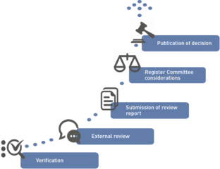
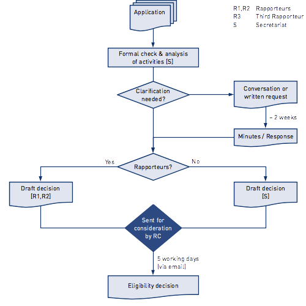
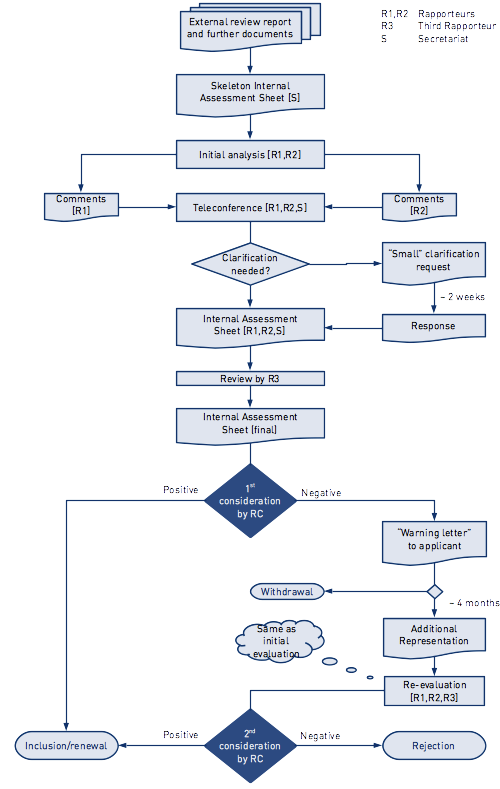
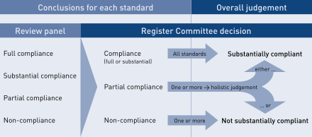

This chapter covers the work of the Register Committee, including the consideration of applications for (initial) inclusion on the Register, periodic renewal of agencies' registration every 5 years and monitoring/accountability of registered agencies during .

## Documents

The following documents are the basis of the Register Committee’s work:

### Statutes
The EQAR Statutes stipulate that substantial compliance with the European Standards and Guidelines (ESG) is the criterion for inclusion on the Register (see Article 20).
The Statutes further provide that the Register Committee decides on inclusion on the Register, and entrust the Committee with elaborating Procedures for Applications to regulate all further details.

[EQAR Statutes, Version 3.0, April 2017](https://www.eqar.eu/assets/uploads/2018/04/EQAR_Statutes_ENv3_0-2017.pdf)

### Procedures

#### Procedures for Applications

The Procedures for Applications outline the application process in detail and stipulate requirements for external reviews.

The first version of the Procedures were adopted by the Register Committee in consultation with the General Assembly in 2008. The Procedures for Applications were revised in 2012 (following four years of practice and the external evaluation of EQAR) and in 2015 (in connection with the transition to the ESG 2015).

> Relevant parts of the Procedures are quoted in the following sections.

[Procedures for Applications, Version 3.0, June 2015](https://www.eqar.eu/assets/uploads/2018/04/Procedures_For_Applicationsv3.0.pdf)

#### Appeals Procedure

Applicants can file an appeal against decisions of the Register Committee on procedural grounds or in the case of perversity of judgement. The official rules are specified in the Appeals Procedure.

[Appeals Procedure, Version 1.0, May 2008](https://www.eqar.eu/assets/uploads/2018/04/AppealsProcedurev1.0-2008.pdf)

### Policies

#### Policy on the Use and Interpretation of the ESG

In relation to the transition to the ESG 2015, the Register Committee adopted a new document providing an ex-ante transparency of the official EQAR interpretation of the ESG. The Policy on the Use and Interpretations of the ESG replaced the “Practices and Interpretations” and aims to increase transparency, understanding and consistency within the decision-making process of the Register Committee. The main target groups of the policy are the quality assurance agencies, the external review coordinators and the external review panels.

[Policy on the Use and Interpretation of the ESG, Version 1.0, June 2015](https://www.eqar.eu/assets/uploads/2018/04/UseAndInterpretationOfTheESGv2_0.pdf)

#### Other Policies

The RC may adopt policies that specify the understanding and application of the Procedures or that address specific cases or circumstances that are not specifically addressed.

> 2.4 The Register Committee may adopt policies to explain its understanding and application of these Procedures in specific cases or circumstances. They shall be published. The General Assembly shall be notified of any policies adopted.

To date, the following policies exist:

 -  The **Merger Policy** addresses situations in which registered agencies are merged with other agencies or organisations.

    [Merger Policy, Version 1.0, May 2012](https://www.eqar.eu/assets/uploads/2018/04/agency_mergersv1.0.pdf)

 -  The **Complaints Policy** sets out how third-party concerns about registered agencies are handled.

    [Complaints Policy, Version 3.0, January 2015](https://www.eqar.eu/assets/uploads/2018/04/Complaints_Policyv3.0.pdf)

### Guide for Applicants

The EQAR Guide for Applicants has been produced by the Secretariat as a useful resource for applicant QA agencies. The Guide summarises all provisions of the Procedures for Applications in plain, non-legal language. The Guide is an explanatory document. Only the Procedures for Applications are binding in the Register Committee’s decision making.

Applicants are invited to complete a feedback questionnaire on the Guide after their application, and the Guide is revised as necessary based on the feedback received.

[Guide for Applicants, Version 4.0, August 2015](https://www.eqar.eu/assets/uploads/2018/04/EQAR_GuideForApplicants.pdf)

## Criteria for Inclusion on the Register

Consistent with the E4 Group’s Report to the London Ministerial Meeting and the ministers’ decision, the EQAR Statutes stipulate that substantial compliance with the European Standards and Guidelines (ESG) is the decisive requirement for inclusion on the Register.

This is specified in the Procedures for Applications:

> 2\. Criteria for inclusion
> 
> 2.1 To be included in the Register, applicants need to substantially comply with the ESG in all eligible activities (see §1.3). Compliance shall be demonstrated through an external review of the applicant (in accordance with §1.6 – 1.18).
> 
> 2.2 Parts 2 (2.1 – 2.7) and 3 (3.1 – 3.7) of the ESG shall be directly relevant for inclusion on the Register, whereas ESG 2.1 includes consideration of how Part 1 of the ESG is addressed.

The ESG are structured in three parts, covering (1) internal (institutional) quality assurance, (2) external quality assurance of higher education and (3) external quality assurance agencies. Parts 2 and 3 are directly relevant for inclusion on EQAR, whereas part 1 is relevant indirectly through reference to it in standard 2.1.

## Applications for Registration/Renewal

### Overview of the Application Process

An application for inclusion on the Register or renewal of registration involves three main steps:

#### Step 1: Verification of eligibility

Upon receipt of an application the Secretariat checks its completeness and compliance with the eligibility requirements specified in the Procedures for Applications.

This concerns the applicant's activities as well as the (planned) external review process. If the requirements are not met, the application is rejected, without, however, making any judgement on the applicant’s compliance with the ESG.

 [Section 3.2 Eligibility for Registration](#Eligibility_for_Registration)

#### Step 2: External review

Following the confirmation of eligibility, the applicant is externally reviewed against the ESG. The review is coordinated by an independent third party, e.g. ENQA or the GAC; EQAR is not directly involved in this step.

 [Section 3.3 External Review](#External_Review)

#### Step 3: Consideration of substantial compliance with the ESG

The applicant submits the external review panel's review report, which is the basis for the Register Committee's decision on the application.

The review report is analysed by rapporteurs, who prepare a draft Register Committee decision on the application.

 [Section 3.4 Submission of Application Documents](#Submission_of_Application_Documents)
 [Section 3.5 Analysis by Rapporteurs](#Analysis_by_Rapporteurs)
 [Section 3.6 Decision Making](#Decision-Making)

All decisions by the Register Committee on eligible applications (approval and rejection decisions) are published together with the full documentation of the application.

### Eligibility for Registration

#### Activities

> 1.3 Registration pertains to all external quality assurance activities within the scope of the ESG, i.e. reviews, audits, evaluations or accreditations of higher education institutions or programmes that relate to learning and teaching in higher education, including the learning environment and relevant links to research and innovation. This is regardless of whether these activities are carried out within or outside the EHEA, and whether they are obligatory or voluntary.
> 
> 1.4 Organisations (or a clearly identified sub-unit thereof) that directly conduct external quality assurance according to §1.3 are eligible for registration.
> 
> 1.5 Registration is open to organisations regardless of whether they are based in Europe or outside, and regardless whether they are national or international in nature.

Only external quality assurance activities (i.e. review, audit, evaluation, accreditation etc. of higher education institutions or programmes) are considered in the remit of the ESG and, thus, only organisations that conduct such activities are eligible for inclusion on the Register.

Organisations which carry out only meta-level activities, such as standard setting or exercising oversight of quality assurance agencies, are not eligible for inclusion on the Register.

If an organisation conducts both external quality assurance activities in higher education as well as other activities, its inclusion on the Register only pertains to those sub-units/activities that are in the remit of the ESG. Nevertheless, all “ESG-type” activities have to be in substantial compliance with the ESG.

If there is a risk of confusion, the Register entry includes a specification to which sub-units or activities registration pertains.

#### Requirements for external eeviews

The requirements for external reviews are set out in the Procedures for Applications. They are obligatory and a precondition for proceeding to consider the applicant’s substantial compliance with the ESG.

The Procedures specify the following requirements:

 -   The review must be coordinated by an organisation that is independent of the applicant and has the necessary professional capacity (§§1.6 – 1.8).
 -   The review panel has to comprise of at least four persons who have sufficient knowledge, experience and expertise for that task. It has to include at least one international expert, one academic staff member and one student (§§1.9 – 1.12).
 -   The self-evaluation report has to reflect on the applicant’s compliance with the ESG (§§1.13 – 1.14).
 -   The external review report has to provide sufficient evidence of the applicant’s substantial compliance with the ESG (§§1.15 – 1.18).

#### Process

Decisions on eligibility are prepared by the Secretariat and usually agreed by email, using the following process:

 1. Formal check of the application by the Secretariat
 1. If clarification on the activities is needed:
	1. The official representative of the applicant agency will be invited to have a telephone conversation with the Secretariat to clarify the issue(s) that arose.
	1. The phone conversation will be followed immediately by an e-mail enclosing the official minute – with the factual summary of the discussion – that the official representative will be asked to agree on.
	1. The official minute of the telephone conversation will be considered and annexed to the draft decision that will be circulated the Register Committee.
	1. If the applicant agency prefers not to have a telephone conversation, a written clarification request will be addressed to the agency.
 1.  Preparation of decision on eligibility:
	1. If there are contentious issues or new principle questions, the Secretariat appoint three rapporteurs for the case
	1. Otherwise, the Secretariat prepares the draft decision
 1.  Draft decision is circulated to the entire RC by email, with a comment deadline of 5 working days
 1.  Secretariat communicates the decision on eligibility to the agency

### External Review

The applicant itself has to identify a suitable review coordinator that has the necessary professional capacity and is independent from the applicant. These requirements are checked at the eligibility stage. The most frequent coordinators of external reviews are ENQA (ca. 75% of cases) and the German Accreditation Council (GAC, ca. 20% of cases).

An assessment of the level of compliance with the ESG should be clearly defined as one purpose of the external review and the fact that the review report will be used for an application for (renewal of) inclusion on EQAR.

The review panel must consist of at least four persons that include at least one student and one academic staff member involved in education and research. The review panel should be fully independent from the applicant and should possess the knowledge, expertise and experience required to review the applicant’s compliance with the ESG. 

The self-evaluation and review reports should clearly address each relevant ESG (standards 2.1 to 2.7 and 3.1 to 3.7) and reflect on the agency’s compliance with it. In reviews that will be used for renewal of an agency's registration, it is expected that the review report explicitly addresses the issues that were flagged when the agency was admitted to the Register.

During the site visit, the external review panel is expected to interview all relevant stakeholders of the applicant agency, including students and staff, as well as external stakeholders, such as employers and external partners of an institution.

### Submission of Application Documents

The Register Committee normally convenes twice a year (spring and autumn). There are two annual deadlines for new applicants to submit the external review reports, 15 March and 15 September, in order to be considered at the following meeting. For renewal applications, the review documents need to be submitted before the expiry of the agency's registration.

The following documents have to be submitted by applicants:

 1.  On-line Application Form
	- Annex 1: signed application form
	- Annex 2: draft Terms of Reference of the external review
 1.  Declaration of Honour ompleted and signed by the review coordinator, including:
	- CV's of all panel members
 	- Terms of Reference of the external review (final)
 1.  Self-evaluation report provided for the external review
 1.  External review report
 1.  Optional documents:
	- Applicant’s statement on the external review report
	- Confirmation of full ENQA membership, if applicable
	- Any prior correspondence between the applicant and ENQA
	- Further supporting documentation

Applicants are required to submit all documentation in English. Even if Register Committee members or Secretariat staff might understand other languages, documents in other languages should not form the basis of decisions taken by the Register Committee.

The coordinator of the external review has to declare in writing that it is independent of the applicant and that it has ensured that the review panel is fully independent of the applicant.

Applicants are guaranteed confidentiality of all documents while their application is being considered, but the Register Committee's final decision and all application documents are published if the application was eligible and complete (i.e. the external review report was submitted); see [section on publication](section on publication)(Management_of_the_Register#Publication-of-decisions) for details.

### Analysis by Rapporteurs

Each application is assigned two rapporteurs who have the responsibility to analyse the documentation and make a recommendation for the Register Committee's decision.

Following the bi-annual application deadline (15 March, 15 September) the Secretariat assigns rapporteurs to the applications, according to a fixed protocol in order of receipt of applications. For renewal applications, one rapporteur will be a Committee member who already acted as rapporteur in the initial application (if still on the Committee).

The Secretariat asks members to declare possible conflicts of interest relating to an application before appointing them as rapporteurs. Furthermore, it is ensured that the rapporteurs for one application are members nominated to the Register Committee by different organisations.

The rapporteurs’ work includes the following steps:

 1.  Each rapporteur reviews the application documents, records his/her comments on the Internal Assessment Sheet and sends it to the Secretariat staff member in charge.
 1.  The Secretariat circulates the two rapporteurs’ Internal Assessment Sheets to each other.
 1.  Rapporteurs discuss their findings in a teleconference facilitated by the Director and the Secretariat staff member in charge.
 1.  If necessary, clarification is requested from the applicants.
 1.  Rapporteurs set out their agreed findings on the Internal Assessment Sheet, with support from the Secretariat.
 1.  The Internal Assessment Sheet is submitted to the third rapporteur for review and comment.

#### Third rapporteur

The third rapporteur comments independently of the main rapporteurs’ assessment. This mechanism helps to improve consistency and to base the preparatory analysis for the RC’s decision-making on a broader perspective.

The third rapporteur’s analysis normally takes place without further clarification requests to the applicant.

The views of the main rapporteurs and the third rapporteur are not discussed or mediated before the meeting. Possible different perspectives on an application are brought before the entire Register Committee.

The Secretariat assists the rapporteurs in their work and provides iterations of the final Internal Assessment Sheet. Once finalised, the Internal Assessment Sheets are circulated to the entire Register Committee in preparation for the meeting.

#### Clarification requests

The principal basis of the Register Committee’s work is the external review report. However, in some cases, additional clarification might be necessary to inform the decision. This may include:

 -   clarification by external review panels where their analysis or conclusions, set out in the report, are unclear;
 -   information or clarification by coordinators where the external review process is concerned;
 -   clarification by applicants themselves.

Additional information and clarification (whether in response to requests or submitted with the application) should only help to supplement and clarify the external review report, and should not be excessive. This is to ensure that externally reviewed evidence remains the main basis of EQAR’s decisions. For the same reason, clarification should with preference be sought from the external review panel; clarification requests to applicants themselves should only be made in exceptional cases.

Where a relatively minor issue can be clarified swiftly, i.e. within about two weeks, a request is addressed to the panel/coordinator/applicant after consideration by rapporteurs and before first consideration by the entire Register Committee (see above, step 4). These requests are drafted by the Secretariat in consultation with rapporteurs and signed by the Director.

(Templates: request to applicant, request to panel or coordinator)

Where major questions remain after the Register Committee has first considered an application, it might defer the application to the next meeting, pending further clarification. This is, however, rare and delays the application by about 6 months. The requests for clarification in such cases are signed by the Chair of the Register Committee.

#### Flagged Issues

In its decisions, the Register Committee used to &quot;flag&quot; certain issues for particular attention when considering a potential application for (further) renewal of inclusion on the Register. Since the status of a flag was, however, difficult to understand in practice, the practice of flagging was discontinued in 2015.

Existing flags nevertheless remain valid, and should receive explicit attention when dealing with the renewal application of an agency. The analysis should state clearly whether rapporteurs consider that the flag has been fully or partially addressed/resolved. If these issues are not satisfactorily addressed in the agency's self-evaluation report and the external review report, rapporteurs should usually request clarification from the panel on the matter.

When confirming eligibility of their application for renewal, agencies are reminded of the flags, if applicable, and they are “translated” to the ESG 2015.

### Decision-Making

#### Factual basis
The main basis of the Register Committee's decision-making is the external review report. This principle should be respected even where other documents are considered.

Decisions made by the Register Committee should normally be based on the factors prevailing when the external review was undertaken. However, as far as is reasonable to do so in light of the considerations above (i.e. additional information should not be excessive; needs to be borne in mind that it was not reviewed) changes and developments since the external review should be taken into account when making a judgement.

#### Judgements on substantial compliance with the ESG

The Register Committee makes a holistic judgement on the agency's compliance with the ESG as a whole,  after considering how an applicant complies with each of the standards. The Register Committee has decided against applying any numerical formula in determining what constitutes **substantial compliance** with the ESG. There are several reasons why, in its view, this would be against the spirit of the ESG:

 -   The ESG were not designed as a checklist, and some standards are broader than others.
 -   Some standards may refer to more essential features of credible external quality assurance than others.
 -   External review panels interpret the ESG differently and use different scales of compliance.
 -   While there might be extenuating circumstances due to different legislative, political and socio-economic factors, the agency has to demonstrate how it meets the requirements of the ESG in its context.

Parts 2 and 3 of the ESG are those with direct relevance to quality assurance agencies and thus serve as criteria for inclusion on the Register. In reviewing the application, the Register Committee analyses each standard and reaches a conclusion of:

 -   compliance (which may be full or substantial),
 -   partial compliance or
 -   non-compliance

There is no distinction between substantial compliance and full compliance, since for inclusion on the Register it is sufficient to substantially comply with the ESG. 

If the agency is in compliance with all standards it is in substantial compliance with the ESG as a whole.

If there are one or several standards with which the agency complies only partially this is considered in the holistic judgement, which might be positive or negative depending on the amount and significance of the areas where only partial compliance has been achieved. However, there are no numerical rules for arriving at a judgement.

As a rule, a conclusion of no compliance for any one standard prevents an overall judgement of substantial compliance.

The Register Committee's final judgement on the agency's compliance with the ESG as a whole can either be *substantially compliant* or *not substantially compliant*. In the latter case, no difference is made between partial or no compliance (see figure above).

There is no possibility for an applicant’s “conditional inclusion”. The Register Committee thus has to have full confidence in an agency’s substantial compliance with the ESG when accepting it on the Register.

#### Possible decisions and consequences

Following the preparatory analysis by rapporteurs the application is considered by the Register Committee for the first time. Three outcomes are possible:

 - Approve the application (§§3.8 &amp; 3.9)
 - Consider rejecting the application (§§3.8 &amp; 3.10)
 - Request clarification (§3.7)

In the first case, the applicant receives the approval decision and the agency is added to the Register. The approval decision (template) is published immediately.

In the second case, the applicant is informed of the grounds for possible rejection and invited to make additional representation (template) on those matters (see §3.10). The application remains pending until the next meeting of the Register Committee, where it may be either approved or rejected, taking into account the additional representation made.

Rejected applicants may reapply within 18 months based on an additional, focused external review addressing those issues that led to rejection. The Register Committee may also invite the rejected applicant to reapply without an additional external review, if it can be verified on the basis of documentation submitted by the applicant itself whether the issues that led to rejection have been satisfactorily addressed. After the 18 months have passed, a new full external review is required to re-apply.

In the third case, the application is deferred to the following meeting, pending further clarification. Clarification can be requested from the applicant, the review panel or the review coordinator (see above). At the following meeting, the application is considered further in the light of the clarification provided. The outcome may, again, be either of the three decisions indicated above.

The applicant can also withdraw the application instead of making additional representation (case 2) or providing further clarification (case 3). Agencies that have withdrawn their application can re-apply at any time.

### Validity Period of Registration

When its application is approved, an agency is admitted to the Register, or has its registration extended, respectively, for five years counted from the date of their external review report. This is always “rounded up” to the end of the month.

### Renewal Applications

Agencies have to apply for renewal of registration before expiry of their current period of inclusion. This application for renewal has to be completed three months after expiry at the very latest, and agencies' registration remains fully valid until a final decision on the application for renewal has been made. Otherwise, agencies' registration is suspended until the decision.

In general, applications for renewal follow the same rules as (initial) applications for inclusion. They need to be based on a complete new review of the agency against the ESG.

### Publication of Decisions

In the interest of transparency and to avoid misinformation, all decisions by the Register Committee on eligible applications are published.

> 5.1 EQAR shall publish:
>
> a. A list of all eligible and complete applications for inclusion on the Register and for renewal of registration; 
> b. All decisions by the Register Committee on those applications, including an account of the reasons for approval or rejection, the external review report and all documentation submitted with the application or obtained by EQAR according to §§3.15 and 3.19; 
> c. Substantive Change Reports made by registered agencies (§6.1) 
> d. Formal warnings according to §7.2 
> e. Decisions concerning a registered agency according to §8.4 

Decisions are published including all application documents, except the applicant's self-evaluation report. This includes further clarification received from review panels or applicant agencies, additional representation made by agencies as well as any other documents submitted with the application.

Rejection decisions are published once they are final and can no longer be challenged in an appeal. Approval decisions are unlikely to be subject to appeal and they are thus published immediately, when the agency is admitted to the Register.

Applications that do not meet the eligibility requirements (e.g. due to the nature of its activities, or due to the external review process not complying with EQAR's requirements) are not published.

In case of applications that were withdrawn after submission of the review report, there will be no decision taken therefore no decision to be published. However, these applications will figure on the list of complete and eligible applications.

Actions on registered agencies (see following sections) will be published at the same time as the action enters into force. While such a decision could be appealed, it would not be understandable if the reasoned decision were not published.

Notwithstanding the above, all application-related information is confidential until the final decision is published. It is of utmost importance that all Register Committee members and observers respect this confidentiality, which is also guaranteed to applicants. There might be legal consequences for EQAR if the confidentiality of documents is violated.

 Chronological list of decisions: https://eqar.eu/documents/decisions.html
 Register of quality assurance agencies: https://eqar.eu/register.html

## Substantive Change Reports

Registered agencies are required to report any substantive changes to EQAR:

> 6.1 A registered agency shall notify EQAR of its own accord about changes to its legal form and status, amendments to its statutes and substantial changes in its process or methodology.
>
> 6.2 The Register Committee shall consider whether these changes warrant an extraordinary revision of registration.

The objective of such reports is that EQAR becomes aware of situations were an agency's current practice differs substantially from the situation when it was reviewed against the ESG and admitted to the Register. Extensive information on reporting changes has been made available to registered agencies in the Guide for Applicants and Registered Agencies, so as to assist them in preparing a Substantive Change Report.

Substantive Change Reports are dealt with as follows:

 1.  The Secretariat acknowledges receipt and screens the report.

 1.  If the changes are minor and it is straight-forward that they only need to be taken note of, skip to step 5 directly.
     
     Otherwise, the Secretariat appoints two rapporteurs, with preference the same Committee members as for the agency's application.

 1.  Rapporteurs review the report and request further clarification or information from the agency, if necessary.

 1.  Rapporteurs make a recommendation to the Committee.

 1.  The Register Committee considers the report, usually by email.

The Committee takes one of the following conclusions:

 -   **Take note** without any action

     This is the default, unless another action is warranted.

 -   Take note and **request further report**

     If there are specific issues that need to be resolved to ensure ESG compliance, but it would not be justified to ask for a new external review. In exceptional cases, also a focused review could be requested.

 -   Initiate an **Extraordinary Revision of Registration** (see below), with a view to:
	- reducing the remaining validity of registration;
	- excluding the agency from the register; or
	- declaring its registration void ab initio.

The Committee normally simply takes note of the report, unless the change reported calls into question whether the agency continues to substantially comply with the ESG.

All Substantive Change Reports and any additional information obtained, where applicable, are published together with the Register Committee's decision.

### Mergers of Registered Agencies

Mergers of registered agencies are a specific case of a Substantive Change, and the Merger Policy (RC8/06.1, adopted 2012) addresses this case.

Provided that all agencies involved in a merger are already registered (or their registration expired not more than 6 months ago), the Committee may provisionally maintain registration of the new, merged agency. “Agencies” here refers to any entity or organisational unit that conducts external evaluation, accreditation or audit of higher education institutions or programmes, and thus could potentially be registered on EQAR.

#### Provisional Registration

Provisional registration is only granted if it can reasonably be established that the analysis and conclusions evidencing the predecessor agencies' compliance with the ESG (set out in the respective reports on the external reviews of the old agencies) remain by and large valid also for the new, merged agency. This is based on information provided by the agency.

The new, merged agency will have to undergo an external review against the ESG at its earliest convenience and within two years at the latest. If the earliest expiry date of the predecessor agencies' registrations *is later*, registration will usually be limited to 24 months counted from the date of the merger. If the earliest expiry date of the predecessor agencies' registrations *is earlier*, registration may exceptionally be prolonged to up to 24 months counted from the date of the merger.

## Third-Party Complaints

Through the Complaints Policy (RC/10.1) EQAR offers anyone a way to raise concerns related to a registered agency’s substantial compliance with the ESG or the integrity of the external review process on the basis of which EQAR admitted an agency to the Register.

The Complaints Policy was initially established in 2011 and revised in July 204 and January 2015. With the latter revision the possibility of anonymous complaints was introduced.

The policy sets out clearly that EQAR does not have a mandate to review individual processes or decisions of registered agencies concerning a particular higher education institution or programme, to construe national legislation, European Union law, or any other applicable rules:

> A complaint will only be considered as an official complaint in the sense of §7.2 of the EQAR Procedures for Applications if it is credible, substantiated and supported by appropriate evidence, references, examples etc.
>
> EQAR will only consider complaints that are related to:
>
>  -   a registered agency’s substantial compliance with the ESG, or
>  -   the integrity of the external review process on the basis of which EQAR admitted an agency to the Register.
> 
> EQAR does not have a mandate to:
>
>  -   review individual processes or decisions of registered agencies concerning a particular higher education institution or programme;
>  -   construe national legislation, European Union law, or any other applicable rules. Concerns as regards compliance with such rules should be addressed to the competent courts or authorities.

Complaints need to be made in writing, preferably using a web form made available on the EQAR website. The form also allows complaints to be made anonymously. According to the Complaints Policy, they should mention at least:
 
>  -   The name of the agency concerned.
>  -   The complainant's concerns with regard to the agency's compliance with the European Standards and Guidelines (ESG) or the integrity of the external review process. Whenever possible, complainants should refer to specific standards or guidelines of the ESG, or to specific articles of EQAR’s Procedures for Application.
>  -   Evidence supporting the concerns (any documents should be attached in plain text or PDF format).
>  -   A statement whether the issue has been taken up with the agency concerned; if so, with what result; if not, for what reason.
>  -   Information on any current or past relationship the complainant has/had with the agency concerned.

The following process is followed to handle Complaints:

 1. The EQAR Secretariat verifies whether the complaint is in line with the Complaints Policy. If the complaint:
	1. is formally admissible, continue to step 2;
	1. is bogus, it will be discarded; the agency will be informed of the fact that a complaint was received and discarded;
	1. is incomplete, the Secretariat asks the complainant to resolve the issue, if feasible (e.g. ask for evidence, clarify relationship with the agency, etc.);
	1. is/remains not in line with the Policy, it will be discarded and the agency will be informed.
 1. The Secretariat appoints two Register Committee members as rapporteurs for the complaint. Rapporteurs analyse whether there is evidence that the agency violated the requirements of the ESG in the specific case and whether the specific case is prima facie evidence for a systemic problem in terms of ESG compliance.
 1. The agency concerned is informed of the complaint and invited to comment; if necessary, clarification or information is requested from the agency.
 1. Based on a recommendation by the rapporteurs, the Register Committee decides to either:
	1. reject the complaint, if it is not substantiated;
	1. issue a formal warning, if the complaint is substantiated but relates to an isolated case and does not substantially affect the agency's compliance with the ESG;
	1. reduce the remaining registration period (§7.4 c of the Procedures), if the complaint is substantiated and leads to serious concerns about the agency’s substantial compliance with the ESG, while it is impossible to make a final judgement without a new external review of the agency;
	1. exclude the agency (§7.4 b), if the complaint is substantiated and the agency is evidently no longer in substantial compliance with the ESG.
 1. In cases 4 (iii) and (iv), according to §7.5 of the Procedures the agency is invited to make representation before a final decision is made.
 1. The final decision is communicated to the agency, the complainant and published.
	1. In case 4 (i) the published decision will not identify the agency.
	1. In cases 4 (ii), (iii) and (iv) the agency has the right to appeal.

There are no specific internal forms or templates for complaints.

## Extraordinary Revision of Registration

An extraordinary revision of an agency's registration is initiated by the Committee if there are substantiated concerns whether the agency is still eligible for registration and fulfils the criteria for inclusion, i.e. substantially complies with the ESG.

> 8.1 The Register Committee shall review its decision to admit a registered agency if substantial procedural errors were made in reaching the initial decision, if the initial decision was based on false information or evidence, or if there are major concerns that the registered agency no longer fulfils the criteria for inclusion.

The extraordinary revision may be based on (see §8.2 of the Procedures):

 -   a Substantive Change Report by the agency (see section 5.12);
 -   a third-party complaint (see section 5.14); or
 -   publicly available information.

The agency concerned has to be notified of the extraordinary revision and needs to be given an opportunity to make representation before any decision is taken. This is similar to the representation made before a rejection decision on an application.

In practice, the Register Committee can notify the agency about an extraordinary revision and invite it to make representation on the planned action at the same time.

The following are the possible actions the Committee can take:

 - **Close the Extraordinary Revision** without action

	If the representation by the agency resolves the concerns.

 - **Reduce the remaining validity** of registration

	If there are serious concerns about the applicant’s fulfilment of the criteria and the Register Committee considers it impossible to make a judgement without a new review” (§8.4 c), i.e. if the concerns about substantial compliance with the ESG are serious and a continued inclusion can only be justified on the basis of a new external review earlier than the regular 5-year period has passed. At the same time, upholding registration can be justified for a certain time, and there is no reason to exclude the agency from the Register immediately.

 - **Exclude the agency** with immediate effect

	If it evidently no longer fulfils the criteria for inclusion” (§8.4 b), i.e. if it obvious that in its structures or activities the agency no longer substantially complies with the ESG. Exclusion is “as from the date on which [the agency](the agency) ceased to fulfil the criteria” (idem).

 - **Declare registration void ab initio**

	(I.e. registration is terminated immediately and considered to never have existed, since the admission decision was flawed from the outset.)

	If the criteria for inclusion were evidently not fulfilled when the decision [to include the agency](to include the agency) was made” (§8.4 a), i.e. if it becomes known to the Committee that the external review process was seriously flawed, documents were not genuine, cases of fraud, etc.

