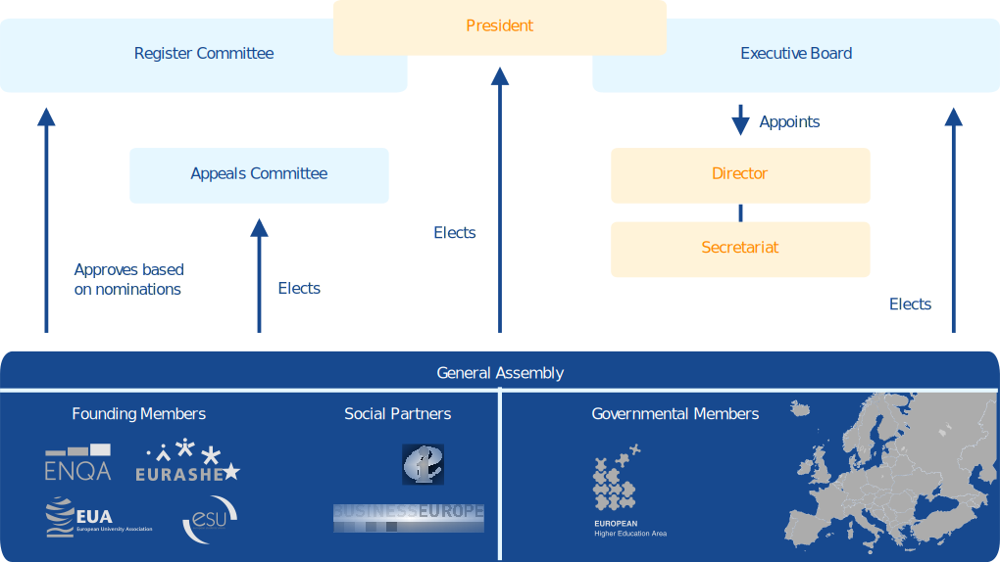

# Organisational Structure

The following organisational chart and table provide an overview of EQAR’s statutory bodies, their relationships and functions. The details are explained in the following sections.

<table class="docutils">
	<tr>
	<th> Body:
	</th>
	<th> Responsibilities:
	</th>
	<th> Composition:
	</th>
	<th> Term of office:
	</th>
	<th> Meetings:
	</th></tr>
	<tr>
	<td> <b>GA</b>
	</td>
	<td> Supreme decision-making body:
	<ul><li> Strategic framework</li>
	<li> Major policy decisions</li>
	<li> Budget, accounts</li>
	<li> Elect President, EB, and AC</li>
	<li> Approve RC nominations</li></ul>
	</td>
	<td>
	<ul><li> Founding Members (E4)</li>
	<li> Social Partner Members (BE, EI)</li>
	<li> <a rel="nofollow" class="external text" href="https://www.eqar.eu/about/eqar-structure/members/">Governmental Members</a></li>
	<li> Observers: Council of Europe, European Commission, UNESCO, Bologna Secretariat</li></ul>
	</td>
	<td> N/A
	</td>
	<td> Once a year, usually in conjunction with 1st BFUG meeting
	</td></tr>
	<tr>
	<td> <b>President</b>
	</td>
	<td>
	<ul><li> Chair EB, RC and GA</li>
	<li> Represent EQAR externally at high-level meetings/events</li>
	<li> Ensure coherence in the work of all EQAR bodies</li></ul>
	</td>
	<td> N/A
	</td>
	<td> Elected for 3 years, renewable once
	</td>
	<td>
	</td></tr>
	<tr>
	<td> <b>MD</b>
	</td>
	<td> Annual event to discuss policy developments in QA
	</td>
	<td> Members + all statutory bodies
	</td>
	<td> N/A
	</td>
	<td> Once a year in the autumn
	</td></tr>
	<tr>
	<td> <b>EB</b>
	</td>
	<td> Ongoing management:
	<ul><li> Strategic/policy decisions between GAs</li>
	<li> Key administrative decisions</li>
	<li> Propose budget, accounts to GA</li>
	<li> Appoint/supervise Director</li></ul>
	</td>
	<td> Chair: President
	
Members: one from each Founding Member (rotating Vice-President and Treasurer)
	

	</td>
	<td> 2 years, renewable 3 times
	</td>
	<td> 3-4 times a year, usually at the EQAR office
	</td></tr>
	<tr>
	<td> <b>RC</b>
	</td>
	<td> All matters related to the management of the Register:
	<ul><li> Procedures for Applications</li>
	<li> Develop policies on specific issues</li>
	<li> Receive, evaluate and decide on applications for inclusion (and renewal) on the Register</li>
	<li> Substantive Change Reports</li>
	<li> Third-party complaints</li>
	<li> Extraordinary revision of registration</li></ul>
	</td>
	<td> Chair: President (non-voting)
	
Members: nominated by E4 (2 each), BUSINESSEUROPE, EI (1 each)
	

Observers: 5 governments (appointed by GA)
	

	</td>
	<td> 2 years, renewable 3 times
	</td>
	<td> Twice a year, usually 2-day meetings in May and November, changing locations
	</td></tr>
	<tr>
	<td> <b>AC</b>
	</td>
	<td> Consider and decide upon appeals
	</td>
	<td>
	<ul><li> Chair</li>
	<li> 2 members</li>
	<li> Deputy-Chair</li>
	<li> 2 deputy members</li></ul>
	</td>
	<td> 4 years, renewable once
	</td>
	<td> As needed
	</td></tr>
	<tr>
	<td> <b>Secretariat</b>
	</td>
	<td>
	<ul><li> Represent EQAR externally</li>
	<li> Support all other bodies</li>
	<li> Internal communication</li>
	<li> Daily management and administration</li>
	<li> Contact point for all third parties</li></ul>
	</td>
	<td> Director (appointed by EB)
	
Further staff hired by the Director
	

	</td>
	<td> Permanent employment contracts
	</td>
	<td> N/A
	</td></tr>
</table>

Members
-------

EQAR’s full members are:

 1.  Founding Members;
 1.  Social Partner Members;
 1.  Governmental Members.

The Founding Members are the E4 Group (ENQA, ESU, EUA, EURASHE), which have founded EQAR following the mandate given by European ministers of higher education.

The consultative members of the Bologna Follow-Up Group (BFUG) that represent the interests of employers or employees can become Social Partner Members. These are currently BUSINESSEUROPE and Education International. The Founding Members and the Social Partner Members together constitute the group of Nongovernmental Members.

All signatory countries of the Bologna Process (as well as the intergovernmental organisations involved in the Bologna Process), can become Governmental Members of the association.

[Full list of members](https://www.eqar.eu/about/eqar-structure/members/)

General Assembly
----------------

The General Assembly (GA) is the supreme decision-making body of the EQAR Association, comprising of all its members. Currently, there are four permanent observers at the GA: the European Commission, the Bologna Secretariat, the Council of Europe and UNESCO. They do not have voting rights. Further observers could be invited ad-hoc.

The GA convenes annually and decides on the budget, approves the accounts, elects the Executive Board and Appeals Committee, and approves the Register Committee.

The Members' Dialogue (MD) is an annual informal gathering, usually held in the autumn, to discuss current policy issues and the future strategic development of EQAR. The MD is an event for representatives of all members and for all members of EQAR's committees.

President
---------

The President is responsible for the leadership of the whole organisation within the frame set by General Assembly, and refined through decisions of the Executive Board and the Register Committee. In particular, the President:

 * chairs the Executive Board, the Register Committee and the General Assembly; 
 * represents EQAR externally at high-level meetings and events;
 * ensures coherence in the work of all EQAR bodies.

The President is the chair and a voting member of the EB, and non-voting chair of the RC and the GA.

The President acts as the legal representative of EQAR and is supported in their functions by the Director and the Secretariat. The workload of the President are estimated at ca. 25% of a full-time position.

To ensure their impartiality the President may not hold a function in any of EQAR’s members or any QA agencies while holding the position of President.

Executive Board
---------------

The Executive Board (EB) is in charge of the ongoing management and strategic coordination of EQAR, including administrative and financial matters. The Executive Board comprises of five members: the President and one from each Founding Member

The Executive Board is elected by the General Assembly for a two-year mandate. It designates the two Vice-Presidents and the Treasurer from among its members.

The Executive Board has agreed to annually rotate the different functions amongst its members. The EB convenes four to five times annually, normally at the EQAR office in Brussels or in conjunction with other meetings.

Register Committee
------------------

The Register Committee (RC) is responsible for all matter related to the management of the Register as such. In particular, the RC:

 -   receives, evaluates and decides upon applications for inclusion on the Register and for renewal of registration;
 -   considers Substantive Change Reports by registered agencies;
 -   considers complaints about registered agencies made by third parties;
 -   may conduct an extraordinary review of an agency's registration;
 -   is responsible for adopting and revising Procedures for Applications in consultation with the GA.

It comprises of eleven members experienced in quality assurance of higher education, acting as independent experts and in their individual capacity.

RC members are expected to declare possible conflicts of interest and to recuse themselves from the meeting during the deliberations on cases where they have a conflict of interest.

Each Founding Member nominates two members of the Register Committee and one member is nominated by each Social Partner.

The Register Committee is approved by the General Assembly for a mandate of two years. A member may be re-nominated up to three times. The RC convenes twice a year, usually for two-day meetings and in varying locations.

### Governmental Observers

Five governmental authorities are nominated by the General Assembly as observers on the Register Committee. The observers are nominated by the GA for a mandate of 2 years, i.e. identical to the mandate of RC members.

Countries are expected to name one individual person that assumes the observer function for the two-year period. The person receives a personalised login to the EQAR internal website (see below).

#### Role

The observers attend the RC meetings and closely follow the work of the Committee. They are included in e-mail communications and deliberations between the regular RC meetings.

Observers are expected not to participate in deliberations, especially in relation to applications. They can, however, ask questions in order to understand the RC's proceedings. During more general discussions the observers may be invited to comment and share their observations.

Observers are expected to declare possible conflicts of interest and to recuse themselves from the meeting during the deliberations on cases where they have a conflict of interest.

#### Documents and Confidentiality

Observers have full access to the RC's documents via the EQAR internal website (<https://www.eqar.eu/login/>). Observers are expected to respect the confidentiality of the RC's deliberations and all documents other than the Committee's published decisions.

Appeals Committee
-----------------

Applicants may appeal decisions of the Register Committee on procedural grounds or in case of perversity of judgement. The Appeals Committee (AC) has the responsibility to consider appeals.

The Appeals Committee consists of a chair, two further members, a deputy chair and two deputy members. They are elected by the General Assembly.

The Appeals Committee is elected for a mandate of four years. The members and deputy members of the AC can be re-elected once. The AC convenes as necessary. In case of appeals the Committee has 120 days to decide on whether to accept or reject the appeal. 

Secretariat
-----------

The Secretariat is in charge of the daily management and administration of EQAR. It supports all other statutory bodies and facilitates internal communication; serves as a contact point for agencies, members, partners and externals; and represents EQAR externally in consultation with the President.

The Secretariat currently (2020) includes staff with the following positions:

 -   Director (full-time)
 -   Sernior Policy Analyst (full-time)
 -   Policy and Project Officer (full-time)
 -   Communications Officer (0,7 FTE)

Based on a permanent mandate by the President, the Director also represents EQAR legally.

